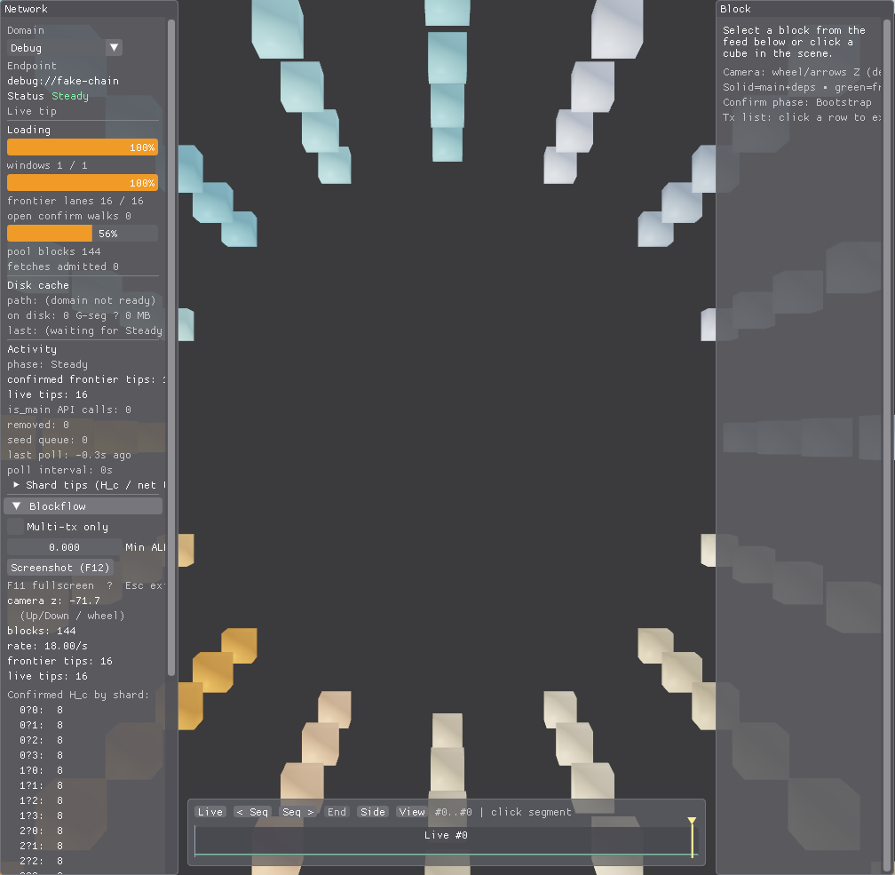
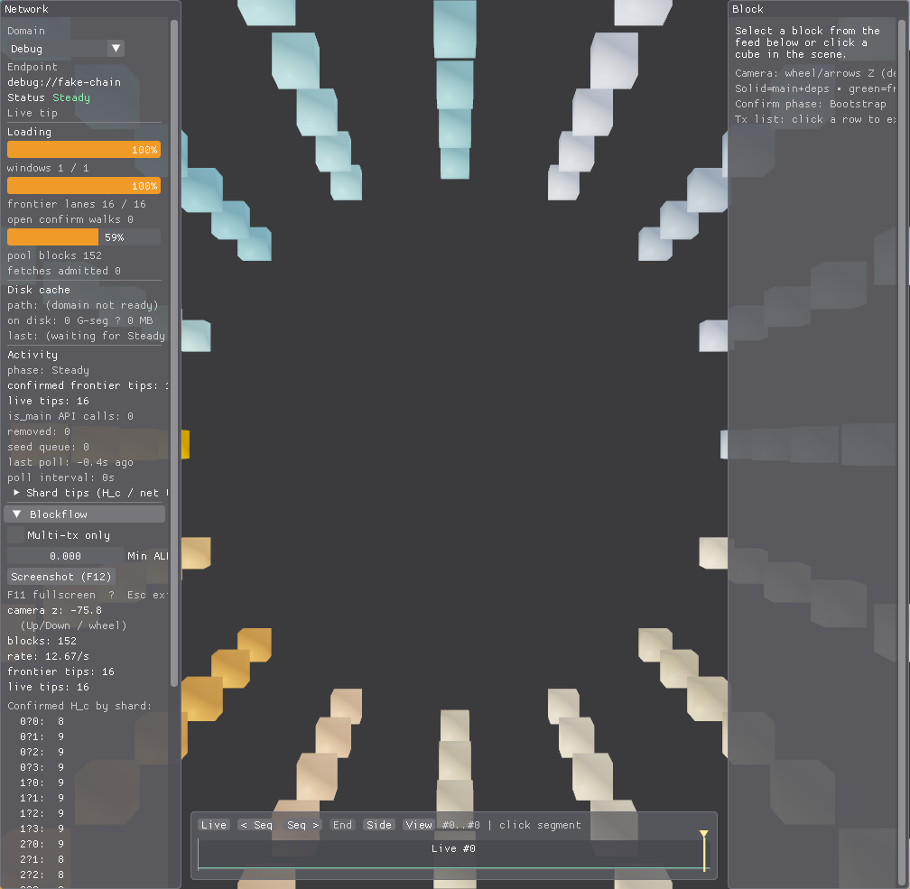
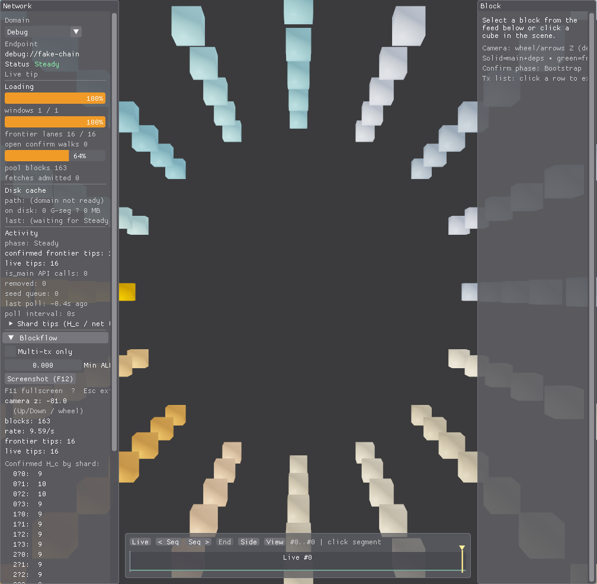

# alephium_blockviz

Cross-platform **Vulkan + ImGui** visualizer for **Alephium BlockFlow** — sixteen shards polled from official (or configured) nodes, plus offline **FakeChain** (Debug). Switch **mainnet** / **testnet** / **Debug** in the Network panel or via `user_prefs.json` + `config.json`.

| | |
|--|--|
| **Host** | Alephium BlockFlow **1.4.4** (`src/app/app_identity.hpp`) |
| **Engine** | BlockvizEngine **1.4.4** (`src/engine/engine_identity.hpp`) |
| **Windows** | `sln/alephium_visualizer.sln` (MSVC) |
| **Linux** | CMake + GLFW — [docs/linux.md](docs/linux.md) |
| **VnV** | `vnv/` · [TESTING.md](vnv/TESTING.md) · `sln/blockviz_vnv.sln` · `.\scripts\run_vnv.ps1` / `./scripts/run_vnv.sh` |
| **CI** | [`.github/workflows/linux-ci.yml`](.github/workflows/linux-ci.yml) (Ubuntu: product build + mod VnV) |

Release tags on `main`: `app-vMAJOR.MINOR.PATCH` + `engine-v…` — see [AGENTS.md](AGENTS.md).

**Docs hub (HTML):** [docs/index.html](docs/index.html) — timeline, network fill, legend, controls, architecture.

## Platform support

| Platform | Host | Build | GUI product | Headless | Mod VnV | Int visual | CI |
|----------|------|-------|-------------|----------|---------|------------|-----|
| **Windows x64** | Win32 | MSVC `sln/` | Supported | Supported | `run_vnv.ps1` | Supported | Local dual-track smoke |
| **Linux x64** | GLFW | CMake + Ninja | Supported | Supported (`VK_EXT_headless_surface`) | `run_vnv.sh` | Supported (DISPLAY or headless goldens) | GitHub Actions (mod) |
| **macOS** | — | — | **Not supported** | — | — | — | Unscheduled ([ROADMAP](docs/ROADMAP.md) P2) |

**Dual-track rule:** Linux CI green does **not** prove Windows MSVC. After changes under `src/*/platform/**`, CMake, or vcpkg platform deps, smoke **both** tracks ([docs/platform.md](docs/platform.md)).

## Features (short)

- Network panel: domain switch, **Stable** / History / Bootstrapping status, disk cache HUD, feed
- 3D BlockFlow cubes + tip/selection **Sobel** outlines
- Selection + dependency BFS fan; camera **End** / **Side** / **Live** (keys **1** / **2** / **3**)
- Timeline **64s subsegments** · **640s G-segments** · Z-proportional minimap
- History fill from **camera 64s subseg** → next unfilled (≤**4** concurrent GETs); live tip open **64s** cell first
- Gray translucent volumes = history fills in flight (fade when admitted)
- **F3** profiler · **F12** GPU screenshot (final swapchain after scene+UI, before present) · **F11** fullscreen

## Visual legend

| Cue | Meaning |
|-----|---------|
| Solid cubes (lane colors) | Blocks in the bag |
| **Green** Sobel / tip arrows | Confirmed per-lane tip `H_c` |
| **Red** Sobel / red tip arrows | Unconfirmed tip surface |
| **Orange** outline | Missing dependencies |
| **Gold** | Selection + dep BFS fan |
| **Cyan translucent plane** | Closed G-segment barrier (never open live tip) |
| **Gray translucent volume** | History **64s** network interval **in flight** (not live tip open cell) |
| Gray volume (dim / fading) | Interval just admitted, or extra queued beyond the 4 in-flight cap |
| Minimap **green** bin | Live G; gold caret = camera Z |

**Concurrent network subsegment GETs:** at most **4** (`HttpIoPool`). Seeing more gray boxes usually means some are **fading** or **dim queued** — not 12 simultaneous HTTP calls.

## Architecture

Layered libraries — living goals and plans:

| Layer | Doc |
|-------|-----|
| Map | [docs/layers/README.md](docs/layers/README.md) |
| App | [docs/layers/app.md](docs/layers/app.md) |
| Engine | [docs/layers/engine.md](docs/layers/engine.md) |
| Graphics | [docs/layers/graphics.md](docs/layers/graphics.md) |
| Network | [docs/layers/network.md](docs/layers/network.md) |
| Platform | [docs/platform.md](docs/platform.md) · [docs/linux.md](docs/linux.md) |
| Timeline guide | [docs/user-guide-timeline.html](docs/user-guide-timeline.html) |

**Roadmap:** [docs/ROADMAP.md](docs/ROADMAP.md) · **Build speed:** [docs/build-performance.md](docs/build-performance.md) · **Docs hub:** [docs/index.html](docs/index.html)

## Build & run

### Windows (MSVC)

1. Install [Vulkan SDK](https://vulkan.lunarg.com/) and MSVC (VS 2022+).
2. `git submodule update --init --recursive` (vendored under `lib/imgui` + `lib/vcpkg` — **do not edit submodule trees**).
3. From the repo root:

```bat
install_deps.bat
```

4. Open `sln/alephium_visualizer.sln`, build **Debug|x64** or **Release|x64**.
5. Run with **cwd = repo root** so `config.json`, `user_prefs.json`, and `resource/` resolve.

### Linux (CMake)

See **[docs/linux.md](docs/linux.md)** (packages or vcpkg, Ninja, run from repo root):

```bash
./install_deps.sh   # optional vcpkg path
cmake -S . -B build -G Ninja -DCMAKE_BUILD_TYPE=Debug \
  -DCMAKE_TOOLCHAIN_FILE="$PWD/lib/vcpkg/scripts/buildsystems/vcpkg.cmake" \
  -DVCPKG_TARGET_TRIPLET=x64-linux
cmake --build build
./build/bin/alephium_visualizer
```

Prefer **Network panel → Debug** (FakeChain) for offline demos without a live node.

### Config

```json
[
  {"url": "https://node.mainnet.alephium.org"},
  {"url": "https://node.testnet.alephium.org"}
]
```

Boot domain prefers `user_prefs.json` (`mainnet` / `testnet` / `debug`); otherwise the first config URL (substring match).

## Screenshots

FakeChain (Debug) product UI — Network + Block rails, tip cubes, timeline minimap.







Testnet with history fill volumes + segment barriers (F12 GPU readback of final frame):


See [color legend](#visual-legend) and [user guide](docs/user-guide-timeline.html) for how to read cyan planes and gray volumes.
