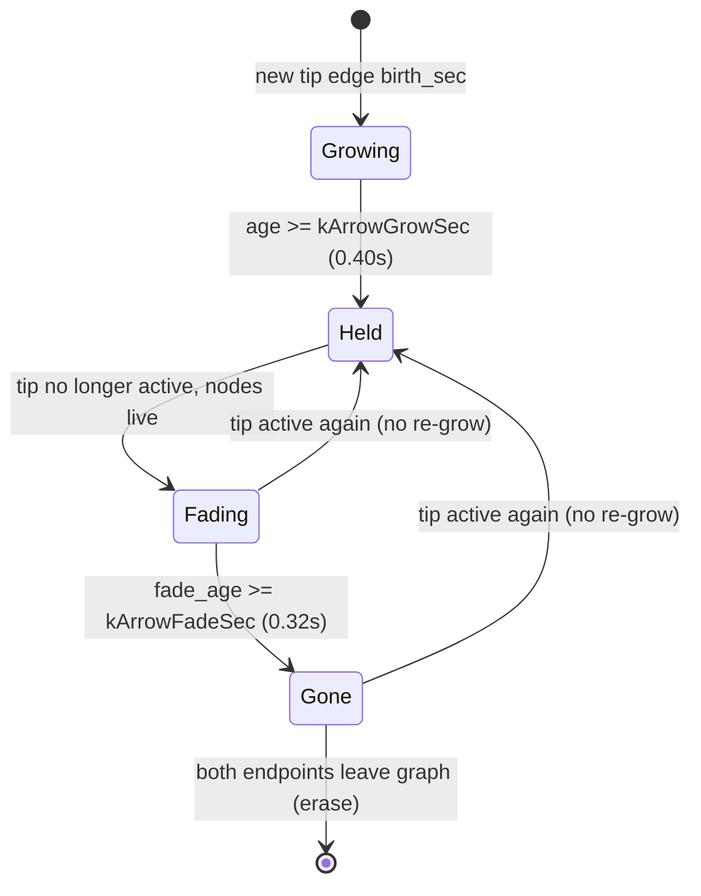
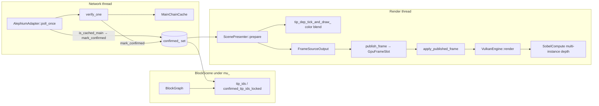
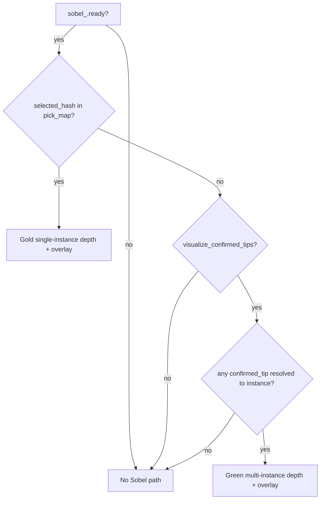
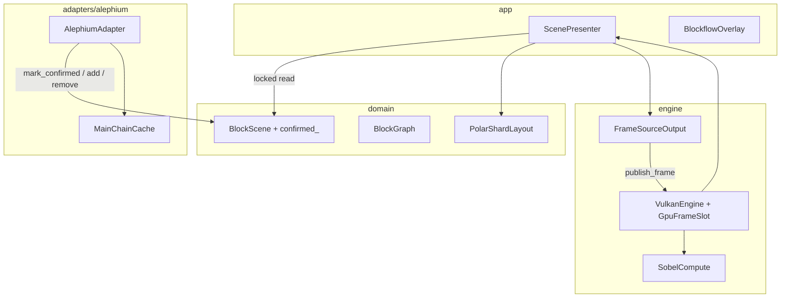

# Design: Latest BlockFlow Visualization (Confirmed vs Unconfirmed Tips)

> **Status: HISTORICAL (landed & evolved).** Original PR1–PR4 (scene confirmed set, green arrows, multi-tip Sobel, HUD) shipped and then grew (frontier `H_c`, confirm walks, cyan/orange incompletes, free-main propagation).  
> **Living docs:** confirmation dual-write & phases → [`docs/layers/network.md`](layers/network.md); presentation colors → [`docs/layers/app.md`](layers/app.md); Sobel GPU path → [`docs/layers/graphics.md`](layers/graphics.md).  
> Paths in this draft (`src/adapters/…`, `VulkanEngine`) predate `src/network/alephium/` and `GraphicsSystem`.

| Field | Value |
|-------|--------|
| **Document** | Latest BlockFlow tip confirmation visualization |
| **Author** | _(owner)_ |
| **Date** | 2026-07-12 |
| **Status** | **Historical (landed & evolved)** — was Draft rev 2; kept for dual-write / Sobel design rationale |
| **Repo** | `C:\Users\JackD\OneDrive\Desktop\alephium_blockviz` |
| **Branch baseline** | `integration/graphics-feature/01` (historical) |
| **Related** | [layers](layers/README.md), tip-dep anim in `ScenePresenter`, Sobel in `graphics/frame/sobel_compute.*` |

---

## Overview

Alephium BlockFlow tips are already drawn as per-lane max-height cubes with cyan dependency arrows that grow once, hold while tip-active, and fade full-length when superseded (`ScenePresenter::tip_dep_tick_and_draw_`). Main-chain membership is already decided on the **network thread** via `MainChainCache` and `AlephiumAdapter::verify_one`, but that confirmed set is **invisible to the render thread**. Selection Sobel outline is gold and single-instance only.

This design bridges confirmation into `BlockScene` under the existing scene mutex, styles tip dependency arrows cyan→green on confirm (without re-grow), and extends the async Sobel path to outline **confirmed tip cubes in green** when nothing is selected (gold selection still wins when a block is selected). The result: at a glance, frontier tips read as *unconfirmed* (shard color + cyan deps) vs *confirmed main-chain tip* (green Sobel + green deps).

**Rev 2 note:** Always-on multi-tip Sobel (once tips verify) is an accepted hot-path cost with a config kill-switch in PR3; poll-time `is_cached_main` → `mark_confirmed` is required; frame plumbing goes through `GpuFrameSlot` + `publish_frame`.

---

## Background & Motivation

### Current tip visualization (working)

| Component | Path | Behavior |
|-----------|------|----------|
| Per-lane tip set | `BlockScene::tip_ids()` in `src/domain/block_scene.cpp` | Max height among live `GraphNode`s per lane (0..15); ties keep multiple hashes |
| Tip dep arrows | `ScenePresenter::tip_dep_tick_and_draw_` | `DepArrowAnim` phases `Growing → Held → Fading → Gone`; color fixed `kActiveArrowColor(0.15, 0.95, 1.0, 0.95)` cyan; re-admit from Fading/Gone → Held **without** re-grow |
| Ephemeral arrows | same presenter | Selection/hover gold; separate keys (`s|…`, `h|…`); grow-only |
| Cube body | `ScenePresenter::prepare` + `PolarShardLayout` | Shard palette color; selection/hover tint only |



### Confirmation exists but is network-thread-only

`MainChainCache` (`src/adapters/alephium/main_chain_cache.*`):

- `main_yes_` positive cache; `mark_main(hash)`; `query_is_main` → `get_blockflow_is_block_in_main_chain`
- `try_hashes_singleton` marks when exactly one hash at height
- **Contract comment:** “Network thread only”

`AlephiumAdapter::verify_one` (`src/adapters/alephium/alephium_adapter.cpp`):

1. Skip if `is_cached_main`
2. Accept via `try_hashes_singleton` / `query_is_main` → `stats_verified_ok_++`
3. Else if transport OK and not main: `scene_.remove_block`, optionally replace with main hash (`mark_main` + `add_block`)

**Poll/enqueue interaction (important):** `enqueue_verify` returns early if `is_cached_main(job.hash)`. The poll loop only enqueues when `!is_cached_main && !verify_done_`. Therefore a hash already in `main_yes_` never re-enters `verify_one`. After `confirmed_` is erased on remove/uncle, **re-admit of a still-cached main hash will not confirm again unless the poll path marks** — see K11.

**Gap:** `ScenePresenter` (render thread) has no read path for “is this hash main-chain proven.” There is no `confirmed` flag on `GraphNode`, no scene-level set, and no field on `FrameSourceOutput`.

### Sobel today is selection-only

- Trigger: `VulkanEngine::render()` maps `selected_hash_` → instance index in `pick_id_to_hash_`; `want_sobel = selected_instance != ~0u`
- Depth: `SobelCompute::record_selection_depth` draws **one** `first_instance` into `sel_depth_`
- Overlay: gold highlight `{1.0, 0.85, 0.15, 1.35}` in `submit_frame_with_async_sobel`
- Scene depth is intentionally unused (comment in `sobel_compute.hpp`)
- Cost today: async Sobel (extra graphics depth pass, CMP submit, overlay CB, `sobel_done_fence_` wait) runs **only when a selection maps to an instance**

### Pain points

1. Operators cannot see which frontier tips have finished main-chain verification.
2. Confirmation work already paid on the network thread is discarded for UX.
3. Green tip outline needs multi-instance depth redraw without breaking the validated async Sobel chain (fence + g→c / c→g semaphores, VUID-09600 serialization).
4. Once tips verify, green Sobel becomes effectively **always-on** — a deliberate hot-path change (K10).

### Baseline assumptions

- Design against **current HEAD of `integration/graphics-feature/01` plus uncommitted tip-dep / camera work** (modified: `scene_presenter.*`, `camera_controller.hpp`, `blockflow_overlay.*`, `vulkan_engine.cpp`). Implementation PRs stack cleanly on that tip.
- Do not change orphan purge, poll cadence, or verify queue policy.

### Codebase claims (spot-checked OK)

| Claim | Verdict |
|-------|---------|
| `BlockScene::tip_ids` per-lane max height, ties keep multiple | True (`block_scene.cpp`) |
| `DepArrowAnim` phases + cyan + no re-grow | True (`scene_presenter.*`) |
| `MainChainCache` network-only; `verify_one` mark/remove/replace | True |
| No scene confirmed flag / no `FrameSourceOutput` confirm field | True |
| Sobel single `first_instance`; gold highlight ~`vulkan_engine.cpp:778` | True |
| Presenter holds scene mutex for full `prepare` | True |
| Adapter does not hold scene mutex across calls | True |
| 16 lanes = `ALPH_NUM_GROUPS²` (4×4) | True |
| `kMaxDepArrows = 512` | True |
| Feed cap 120 is feed-only, **not** a graph-size bound | True |

---

## Goals & Non-Goals

### Goals

1. **Confirmed tip readability:** Max-height tips that are main-chain proven get green Sobel outline (when unselected) and green dependency arrows.
2. **Unconfirmed tips unchanged in body color:** Keep shard palette cubes; cyan dep arrows until confirm.
3. **Confirm transition:** On confirm, arrows **lerp cyan → green** at full length; **no re-grow**. Cubes acquire green Sobel without body recolor (outline only).
4. **Supersede path unchanged:** Existing fade-out full-length alpha fade when tip no longer active; erase only when endpoints leave the graph.
5. **Selection + tip arrows:** Gold Sobel + gold/ephemeral selection/hover arrows still win for the selected (and hover) UX. **Tip dep arrows keep cyan/green under selection; gold ephemeral arrows are additive** (do not hide tip arrows when selected).
6. **Thread-safe bridge:** Network thread marks confirmation into `BlockScene` under `mu_`; render thread reads under the same mutex already held in `ScenePresenter::prepare`.
7. **Correct re-admit:** Poll-time and verify early-exit paths re-mark scene confirmation whenever `MainChainCache` already knows the hash is main.
8. **Incremental, reviewable PRs** with kill-switch for always-on tip Sobel in the engine PR (see PR Plan).

### Non-Goals (explicitly out of scope)

| Item | Reason |
|------|--------|
| Dual simultaneous gold **and** green Sobel overlays | MVP: one edge buffer / one highlight color per frame |
| Height-based confirm-depth heuristic as **sole** confirmation | Real confirm = API/`MainChainCache` only; `ALPH_MAIN_CHAIN_CONFIRM_DEPTH` remains hot-zone priority for verify queue |
| Meshlets / mesh pipeline changes | Unrelated |
| Changing orphan purge / uncle eviction policy | Unrelated |
| Recoloring non-tip confirmed blocks | Product is **tip** frontier, not full main-chain paint |
| Green cube fill (body albedo) | Product table: outline + arrows only |
| Persisting confirm across process restart | In-memory only, like `main_yes_` |
| Bounding `confirmed_` tighter than erase-on-remove | Accepted growth like `main_yes_` (see Data Model) |
| Throttled / every-N-frame tip Sobel | Rejected for MVP; kill-switch is the escape hatch |

---

## Key Decisions

| # | Decision | Rationale |
|---|----------|-----------|
| K1 | Plumb confirmation through **`BlockScene`** (`mark_confirmed` self-locking; `is_confirmed_locked` / `confirmed_tip_ids_locked` for presenter), not by sharing `MainChainCache` with the render thread | Cache is documented network-only; scene mutex is the established adapter↔presenter bridge |
| K2 | Call `scene_.mark_confirmed(hash)` from the adapter on **all** verify-success paths (including early `is_cached_main`, singleton, query-ok, replace) **without** forcing extra `mark_main` | Scene dual-write is the bridge; cache writes stay where they already are |
| K3 | Keep `DepArrowAnim` phase machine; add **color target + blend**, not a new phase | Confirm is a styling event; “no re-grow” already encoded in Held/Fading→Held |
| K4 | `FrameSourceOutput` carries **confirmed tip hashes**; engine multi-draws them into `sel_depth_` | Presenter owns domain knowledge; engine stays domain-light (hash→instance via existing `pick_map`) |
| K5 | **MVP Sobel priority:** if selection active and picked instance exists → gold selection Sobel; else if confirmed tips visible → green multi-tip Sobel; else no Sobel | One overlay color/buffer; gold wins |
| K6 | Confirm only changes **arrow color target**; fade/grow timings and erase rules stay | Lowest risk to tip-dep UX |
| K7 | Erase confirmed on **`remove_block` and uncle eviction inside `add_block`** (shared private erase helper) | Uncle path does not call `remove_block`; easy to miss |
| K8 | **Config kill-switch in PR3** (`visualize_confirmed_tips` / engine flag, default **on**): disables tip green Sobel only (arrows may still green from PR2) | Always-on Sobel needs runtime rollback without git-revert |
| K9 | **Frame plumbing:** extend `GpuFrameSlot` + `publish_frame` to carry `confirmed_tip_hashes`; load into `sobel_tip_hashes_` in `apply_published_frame` next to `pick_id_to_hash_` | Same coherence as pick_map/instance buffer; not a loose member set after prepare |
| K10 | **Always-on multi-tip Sobel accepted** once tips verify and no selection: full async path (depth + CMP + overlay + fence) runs most frames | Product requires continuous green tip outlines; cost documented with perf budget and kill-switch |
| K11 | **Poll-time mark required:** after each poll admit (whether `add_block` returns true or false), if `is_cached_main(hash)` → `scene_.mark_confirmed(hash)` | Cached-main never re-enters `verify_one`; re-admit after erase would stay unconfirmed forever without this |

---

## Proposed Design

### High-level data flow



### 1. Domain: confirmed set on `BlockScene`

**Files:** `src/domain/block_scene.hpp`, `src/domain/block_scene.cpp`

#### Final public API (normative)

```cpp
// Network thread / adapter: self-locking (like add_block / remove_block).
// Do NOT call while already holding mutex().
void mark_confirmed(const NodeId& hash);

// Presenter only: call while holding scene.mutex().
// Self-locking overloads intentionally omitted for these two (deadlock risk).
bool is_confirmed_locked(const NodeId& hash) const;
std::vector<NodeId> confirmed_tip_ids_locked() const;
```

Private (implementation detail):

```cpp
void mark_confirmed_unlocked_(const NodeId& hash);   // mu_ held
void erase_confirmed_unlocked_(const NodeId& hash);  // mu_ held — used by remove + uncle
bool is_confirmed_unlocked_(const NodeId& hash) const;
std::vector<NodeId> confirmed_tip_ids_unlocked_() const;
```

`tip_ids()` remains as today (graph snapshot only; does not take `mu_`). `confirmed_tip_ids_locked` filters tip results by `confirmed_` under the caller's held lock.

#### Storage

```cpp
std::unordered_set<NodeId> confirmed_; // guarded by mu_
```

#### Semantics

| API / path | Behavior |
|------------|----------|
| `mark_confirmed(h)` | No-op if `h.empty()`; insert into `confirmed_`. Idempotent. **Does not require graph membership** (safe if mark races before/after add). |
| `is_confirmed_locked(h)` | Lookup in `confirmed_`; caller holds `mu_` |
| `confirmed_tip_ids_locked()` | Live tips ∩ `confirmed_`; caller holds `mu_` |
| `remove_block(h)` | Existing remove + `erase_confirmed_unlocked_(h)` under same lock |
| Uncle eviction in `add_block` | For **each** hash in `removed_uncles`, call `erase_confirmed_unlocked_(unc)` under the same `mu_` as the graph apply — **not** via `remove_block` |

```cpp
// Inside add_block, after computing removed_uncles / applying delta:
for (const NodeId& unc : removed_uncles)
    erase_confirmed_unlocked_(unc);
```

**Locking (normative):**

| Caller | Holds `mu_`? | API |
|--------|--------------|-----|
| Adapter network thread | No | `mark_confirmed` (self-locking) |
| `ScenePresenter::prepare` | Yes for full prepare | `is_confirmed_locked` / `confirmed_tip_ids_locked` only |
| Never | — | Do not add a self-locking `is_confirmed()` used from prepare |

### 2. Adapter: mark confirmation (scene-only dual-write)

**File:** `src/adapters/alephium/alephium_adapter.cpp` (+ optional private helper in `.hpp`)

#### Helper (scene only — preferred)

```cpp
// Private. Does NOT call mark_main — cache writes stay at existing sites.
void AlephiumAdapter::mark_scene_confirmed_(const std::string& hash)
{
    if (hash.empty()) return;
    scene_.mark_confirmed(hash);
    ++stats_confirmed_marks_;
}
```

Do **not** wrap `mark_main` inside this helper: call sites that already ran `try_hashes_singleton` / `query_is_main` / explicit `mark_main` would double-write the cache and obscure the dual-write audit.

#### Dual-write matrix (required — PR1 acceptance)

| Branch | Approx. site | Cache write (existing) | Scene mark (required) |
|--------|--------------|------------------------|------------------------|
| Early `is_cached_main(job.hash)` | `verify_one` start | already in cache | `mark_scene_confirmed_(job.hash)` then return |
| `try_hashes_singleton` success | `verify_one` | singleton `mark_main`s | `mark_scene_confirmed_(job.hash)` |
| `query_is_main` success | `verify_one` | query `mark_main`s | `mark_scene_confirmed_(job.hash)` |
| Replace: after choosing `main_hash` | `verify_one` end | `mark_main(main_hash)` (existing) | After `add_block(block)`, **always** `mark_scene_confirmed_(main_hash)` — **ignore** `add_block` bool |
| Poll admit / re-see | `poll_once` loop | none here | After `add_block` **or when hash already live**: if `is_cached_main(block_hash)` → `mark_scene_confirmed_(block_hash)` |

**Poll path (K11 — required, not optional):**

```cpp
const bool added = scene_.add_block(block);
// Re-admit or first admit of cached-main must re-populate confirmed_
// (enqueue_verify skips is_cached_main; verify_one will never run).
if (main_chain_cache_.is_cached_main(block_hash))
    mark_scene_confirmed_(block_hash);
// ... enqueue_verify only if !is_cached_main && !verify_done_ (unchanged)
(void)added; // mark does not depend on add result
```

**Replace path:**

```cpp
main_chain_cache_.mark_main(main_hash);  // existing
// ... fetch block ...
scene_.add_block(block);                 // may return false if already live
mark_scene_confirmed_(main_hash);        // ALWAYS — do not gate on add_block return
```

**Do not** mark on transport failure or NOT-main remove path.

### 3. Presenter: confirmed arrow styling

**Files:** `src/app/scene_presenter.hpp`, `src/app/scene_presenter.cpp`

#### Constants

```cpp
// existing
const glm::vec4 kActiveArrowColor(0.15f, 0.95f, 1.0f, 0.95f);   // cyan unconfirmed
// new
const glm::vec4 kConfirmedArrowColor(0.20f, 0.95f, 0.35f, 0.95f); // green main-chain tip
constexpr float kConfirmBlendSec = 0.35f; // cyan→green lerp duration
```

#### `DepArrowAnim` extensions

```cpp
struct DepArrowAnim
{
    // ... existing fields ...
    bool  tip_confirmed     = false; // last known confirm state for edge's tip (to hash)
    float confirm_blend_t   = 0.f;   // 0 = cyan, 1 = green
    float confirm_blend_from = 0.f;  // value when transition started
    float confirm_blend_start_sec = -1.f; // <0 = no active blend
};
```

#### Confirm blend tick (normative)

**Only update confirm blend for keys in `active_keys` (Growing/Held refresh).**  
**Fading / Gone keep the last `confirm_blend_t` (freeze on fade).** Never reset `birth_sec` or force `Growing` for confirm.

For each active edge with tip `e.to`:

```text
bool conf = scene_.is_confirmed_locked(e.to);
if (conf != anim.tip_confirmed) {
  anim.tip_confirmed = conf;
  anim.confirm_blend_from = anim.confirm_blend_t;
  anim.confirm_blend_start_sec = now;
}
float target = conf ? 1.f : 0.f;
if (anim.confirm_blend_start_sec >= 0.f) {
  float u = clamp((now - confirm_blend_start_sec) / kConfirmBlendSec, 0, 1);
  anim.confirm_blend_t = mix(confirm_blend_from, target, u);
  if (u >= 1) confirm_blend_start_sec = -1;
} else {
  anim.confirm_blend_t = target;
}
```

#### Draw color (all phases drawn)

```cpp
glm::vec4 color = glm::mix(kActiveArrowColor, kConfirmedArrowColor, anim.confirm_blend_t);
color.a = alpha; // existing phase alpha still applies
```

#### Selection interaction

When a block is selected, **still run** tip-dep tick/draw with cyan/green. Gold ephemeral selection arrows are **additive** (separate keys). Do not skip tip-dep drawing under selection.

### 4. Frame output: tip hashes for Sobel

**File:** `src/engine/blockviz_engine_api.hpp`

```cpp
struct FrameSourceOutput
{
    std::vector<GpuInstance> instances;
    std::vector<std::string> pick_map;
    bool      has_look_target = false;
    glm::vec3 look_target_pos{ 0.f };
    UiSnapshot ui{};

    // Confirmed tip hashes still present in this frame's pick_map (frustum-culled out = omitted).
    // Engine maps hash → instance index for multi-draw Sobel depth.
    std::vector<std::string> confirmed_tip_hashes;
};
```

**Populate in `ScenePresenter::prepare`** (while holding scene mutex), after instance build:

```cpp
const auto conf_tips = scene_.confirmed_tip_ids_locked();
std::unordered_set<std::string> conf_set(conf_tips.begin(), conf_tips.end());
for (const auto& h : out.pick_map) {
  if (conf_set.count(h))
    out.confirmed_tip_hashes.push_back(h);
}
// Cap push to max 32 (16 lanes + ties)
if (out.confirmed_tip_hashes.size() > 32)
  out.confirmed_tip_hashes.resize(32);
```

Do **not** put unconfirmed tips in this list.

### 5. Engine + Sobel: multi-instance green tips

**Files:**

- `src/engine/blockviz_engine_api.hpp` / `IBlockvizEngine::publish_frame` signature
- `src/engine/vulkan_engine.hpp` / `.cpp` (`GpuFrameSlot`, `publish_frame`, `apply_published_frame`, `render`)
- `src/engine/sobel_compute.hpp` / `.cpp`
- `src/app/scene_presenter.cpp` (fill `confirmed_tip_hashes`)
- Config surface for kill-switch (see K8)

#### 5.1 Always-on Sobel cost (K10)

**Today:** `want_sobel` is true only when `selected_hash_` maps to an instance.

**After this feature:** whenever confirmed tips are visible and nothing is selected (and kill-switch is on), every such frame takes the **full** async Sobel path:

| Cost component | Notes |
|----------------|-------|
| Selection-depth graphics work | One clear + ≤32 indexed cube draws |
| Extra queue submits | Graphics (depth) → CMP (dispatch) → Graphics (overlay) |
| `sobel_done_fence_` | Serializes chains so shared `sel_depth_` / edge images are not rewritten mid-flight (VUID-09600) |
| Overlay CB | Fullscreen edge composite |

Depth draws (≤32) are **not** the dominant cost; fence waits + extra submits + overlay dominate. In steady state after tips verify, this is **essentially every frame** with no selection — a major behavioral change vs selection-only Sobel.

**Accepted for MVP** with:

1. Config kill-switch (default on) in **PR3**
2. Perf acceptance criteria (below)
3. No every-N-frame throttle in MVP (would flicker outlines)

**Perf acceptance criteria (PR3):**

| Criterion | Target |
|-----------|--------|
| Before/after frame time | Measure median frame time with validation layers **off**, unselected, ≥16 confirmed tips visible; document delta. Soft target: **&lt; 2 ms median regression** on the project's usual debug/release workstation; if exceeded, default kill-switch remains available and investigate fence/wait overlap |
| Continuous Sobel soak | ≥ **1 minute** unselected with confirmed tips: no hang, no growing latency, no validation timeouts |
| Selection path | Selecting a block still gold-only; deselect restores green without stutter |
| Validation | Debug build clean under continuous tip Sobel (same barrier pattern as today) |

#### 5.2 Frame plumbing (K9 — normative)

Mirror pick_map coherence end-to-end:

```cpp
// GpuFrameSlot (vulkan_engine.hpp) — extend
struct GpuFrameSlot {
  std::vector<GpuInstance> instances;
  CameraUBO camera{};
  uint64_t client_seq = 0;
  std::vector<std::string> pick_map;
  std::vector<std::string> confirmed_tip_hashes; // NEW
};

// IBlockvizEngine / VulkanEngine::publish_frame
void publish_frame(const FrameSubmit& frame,
                   const std::vector<std::string>& pick_map,
                   const std::vector<std::string>& confirmed_tip_hashes);

// apply_published_frame:
//   pick_id_to_hash_ = slot.pick_map;
//   sobel_tip_hashes_ = slot.confirmed_tip_hashes;
```

**Call site in `render_loop`** (after `prepare`):

```cpp
publish_frame(submit, fout.pick_map, fout.confirmed_tip_hashes);
```

Empty frame-source branch: publish empty `confirmed_tip_hashes` (clear tips for that frame).

Do **not** assign a loose member only after prepare outside `publish_frame` / `apply_published_frame` — tip hashes must stay paired with the same `pick_map` / instance buffer the multi-draw indexes into.

#### 5.3 `want_sobel` rewrite and submit signature

```cpp
// In render(), after apply has filled pick_id_to_hash_ + sobel_tip_hashes_:
SobelFrameRequest req{};
bool want_sobel = false;

if (sobel_.ready() && visualize_confirmed_tips_ /* kill-switch; selection gold always on */) {
  // Selection gold always attempts when selected maps; kill-switch only gates *green tip* mode.
}
// Cleaner split:
uint32_t selected_instance = resolve_selected_instance(); // ~0u if none
std::vector<uint32_t> tip_indices = resolve_hashes(sobel_tip_hashes_, pick_id_to_hash_);

if (sobel_.ready() && selected_instance != ~0u) {
  req.mode = SobelFrameRequest::Mode::SelectionGold;
  req.instance_indices = { selected_instance };
  want_sobel = true;
} else if (sobel_.ready() && visualize_confirmed_tips_ && !tip_indices.empty()) {
  req.mode = SobelFrameRequest::Mode::ConfirmedTipsGreen;
  req.instance_indices = std::move(tip_indices); // already capped ≤32
  want_sobel = true;
}

// ...
if (want_sobel)
  submit_frame_with_async_sobel(frame_index, image_index, graphics_cb,
                                image_available, render_finished, req);
```

```cpp
struct SobelFrameRequest {
  enum class Mode { SelectionGold, ConfirmedTipsGreen } mode;
  std::vector<uint32_t> instance_indices; // size 1 for selection; 1..32 for tips
};

void submit_frame_with_async_sobel(..., const SobelFrameRequest& req);
```

Highlight:

```cpp
const float kGoldHighlight[4]  = { 1.0f, 0.85f, 0.15f, 1.35f };
const float kGreenHighlight[4] = { 0.25f, 0.95f, 0.40f, 1.35f };
// SelectionGold → kGold; ConfirmedTipsGreen → kGreen
```

**Kill-switch semantics:** `visualize_confirmed_tips` (config or engine member, default **true**) disables **ConfirmedTipsGreen** only. Selection gold Sobel is unaffected. Arrow green (PR2) is independent (presenter).



#### 5.4 Multi-instance depth draw (normative)

Extend `SelectionDepthDrawParams`:

```cpp
struct SelectionDepthDrawParams
{
    VkCommandBuffer cmd = VK_NULL_HANDLE;
    VkDescriptorSet ubo_set = VK_NULL_HANDLE;
    VkBuffer vertex_buffer = VK_NULL_HANDLE;
    VkBuffer instance_buffer = VK_NULL_HANDLE;
    VkBuffer index_buffer = VK_NULL_HANDLE;
    const uint32_t* instance_indices = nullptr;
    uint32_t instance_index_count = 0; // required ≥1 when recording for sobel
    uint32_t index_count = 36;
    uint32_t width = 0;
    uint32_t height = 0;
};
```

**Hard rule — single pass only:**

```text
one vkCmdBeginRendering
  one depth CLEAR (LOAD_OP_CLEAR)          // existing
  bind pipeline / buffers / UBO once
  for i in 0 .. instance_index_count-1:    // N ≤ 32
    vkCmdDrawIndexed(..., instance_indices[i])
one vkCmdEndRendering
then existing record_sel_depth_release_for_compute
```

**Forbidden:** second `BeginRendering`, re-clear, or intermediate barriers that wipe `sel_depth_` between tip draws.

Depth test `LESS` (existing pipeline) forms a union silhouette. Overlay highlight is push-constant — **no shader change**.

Async chain (fence serialize, g2c / cfin semaphores) **unchanged** if multi-draw stays inside this single depth pass.

### 6. Cube body behavior (product table)

| State | Cube body | Outline | Dep arrows |
|-------|-----------|---------|------------|
| Unconfirmed tip | Shard color | none (unless selected) | cyan |
| Confirmed tip | Shard color (no green fill) | green Sobel if unselected + kill-switch on | green (blended) |
| Unconfirmed → confirmed | unchanged body | green Sobel appears next frames | lerp cyan→green |
| Tip superseded | existing | none (no longer tip) | full-length fade; **frozen** last blend color |
| Selected (any) | white mix tint (existing) | **gold** Sobel | gold ephemeral **+** tip arrows still cyan/green (additive) |

### Architecture diagram (layers)



### Sequence: confirm a live tip

```mermaid
sequenceDiagram
  participant Net as Network thread
  participant Ad as AlephiumAdapter
  participant MCC as MainChainCache
  participant BS as BlockScene
  participant SP as ScenePresenter
  participant Pub as publish_frame / GpuFrameSlot
  participant VE as VulkanEngine
  participant SC as SobelCompute

  Net->>Ad: drain_verify → verify_one(job)
  Ad->>MCC: query_is_main(hash)
  MCC-->>Ad: true + mark_main
  Ad->>BS: mark_confirmed(hash)
  Note over BS: confirmed_ insert under mu_

  VE->>SP: prepare(fin, fout)
  SP->>BS: lock mutex; confirmed_tip_ids_locked
  SP->>SP: tip_dep blend → green
  SP-->>VE: fout.confirmed_tip_hashes
  VE->>Pub: publish_frame(instances, pick_map, confirmed_tip_hashes)
  Pub->>VE: apply_published_frame → sobel_tip_hashes_
  VE->>SC: record_selection_depth one clear + N draws
  VE->>SC: dispatch Sobel + green overlay
```

### Performance / scale estimates

| Quantity | Expected | Notes |
|----------|----------|-------|
| Lanes | 16 | `ALPH_NUM_GROUPS²` layout |
| Confirmed tips drawn | ≤16 typical; ≤32 hard cap | Ties at max height rare |
| Extra depth draws | ≤32 indexed draws | Cheap vs full async path |
| Full async Sobel path | **Most frames** once tips confirmed & unselected | Dominant: fence + 2 extra submits + overlay (K10) |
| `confirmed_` set size | Unbounded growth like `main_yes_` | Erase on remove/uncle; **not** capped by feed (120) or graph prune (unused today). Drawing still safe: tip filter + pick_map |
| Arrow blend cost | O(active tip edges) | Already capped `kMaxDepArrows = 512` |
| Latency to green | verify queue + poll; hot zone prioritized | Visual blend 0.35s after mark |

---

## API / Interface Changes

### `BlockScene` (`block_scene.hpp`) — final surface

```cpp
// Self-locking — network / adapter only
void mark_confirmed(const NodeId& hash);

// Caller must hold mutex() — presenter only
bool is_confirmed_locked(const NodeId& hash) const;
std::vector<NodeId> confirmed_tip_ids_locked() const;
```

No public self-locking `is_confirmed()` in MVP (avoids accidental use from prepare).

### `FrameSourceOutput` / `publish_frame`

```cpp
// FrameSourceOutput
std::vector<std::string> confirmed_tip_hashes;

// IBlockvizEngine
void publish_frame(const FrameSubmit& frame,
                   const std::vector<std::string>& pick_map,
                   const std::vector<std::string>& confirmed_tip_hashes);
```

### `SelectionDepthDrawParams` / `SobelCompute`

- Multi-instance indices; **one clear + N draws** in a single rendering scope.
- No shader changes (highlight push-constant).

### `VulkanEngine`

- `GpuFrameSlot.confirmed_tip_hashes`
- `sobel_tip_hashes_` loaded in `apply_published_frame`
- `SobelFrameRequest` + rewritten `want_sobel`
- `visualize_confirmed_tips_` kill-switch (default true)

### Unchanged public surfaces

- `IBlockvizEngine` selection API (aside from `publish_frame` arity)
- `MainChainCache` network-only contract
- `DebugDrawer::add_arrow` signature
- Cube instance layout (`GpuInstance`)

---

## Data Model Changes

### In-memory only

```text
BlockScene {
  ...
  unordered_set<NodeId> confirmed_;  // NEW, under mu_
}
```

No disk, no JSON schema, no `GraphNode` field (keeps graph chain-agnostic; confirmation is Alephium adapter policy projected into scene).

### Migration

None. Cold start: tips cyan until first successful verify **or** poll-time cached-main mark.

### Consistency rules

1. `confirmed_` may contain hashes not currently in the graph (mark without membership). **Accepted** — same spirit as `main_yes_` growth. Drawing is safe: `confirmed_tip_ids_locked` ∩ live tips ∩ pick_map.
2. On remove **and** uncle eviction: erase from `confirmed_`.
3. `MainChainCache::main_yes_` and `confirmed_` diverge only if a dual-write path is missed — dual-write matrix is the audit list.
4. **Growth:** Graph `prune()` is not called from the adapter today; live graph grows with admits minus uncles/NOT-main removes. `confirmed_` mirrors marks with erase-on-remove only — **unbounded like `main_yes_`**. Not urgent at current scale; not enforced to `<<1e5`. Optional future: mark only when `graph_.contains(h)` or GC non-tip confirmed after N frames — out of MVP.

---

## Alternatives Considered

### A1. Share `MainChainCache` with render thread (mutex it)

| Pros | Cons |
|------|------|
| No second set | Cache is network-oriented (HTTP, tips array); mixes layers |
| Single source of truth | Presenter would depend on adapters/alephium |
| | Risk of blocking render on any future network call misuse |

**Rejected** in favor of scene bridge (K1).

### A2. Put `bool main_chain` on `GraphNode`

| Pros | Cons |
|------|------|
| Travels with snapshots | Graph is chain-agnostic by design (`block_graph.hpp` header) |
| Layout could color by flag | Confirmation is Alephium-specific policy |

**Rejected** for layering; optional later if multi-chain shares a generic “finalized” bit.

### A3. Color tip cube body green instead of Sobel

| Pros | Cons |
|------|------|
| No Sobel multi-draw work | Fights shard identity; product asked for Sobel outline |
| Simpler engine path | Less consistent with selection language (outline = focus/state) |

**Rejected** for product fidelity; may remain a debug toggle later.

### A4. Dual Sobel (gold + green simultaneous)

| Pros | Cons |
|------|------|
| Select confirmed tip and still see green tips | Needs two depth targets or multipass overlays; more barriers |
| | Out of scope per product non-goals |

**Deferred.**

### A5. Infer confirmation from height depth only (`tip - height >= D`)

| Pros | Cons |
|------|------|
| No API bridge | False positives/negatives vs real main-chain |
| | Product: API-proven only |

**Rejected** as sole signal; hot-zone depth remains verify **priority** only.

### A6. Non-Sobel tip outline (debug-draw wire / edge quads)

| Pros | Cons |
|------|------|
| Avoids always-on async Sobel cost | Different look from selection gold edges |
| Simpler engine; no fence path | Product language is Sobel parity with selection |
| Good emergency fallback | Two outline systems to maintain |

**Rejected for MVP** in favor of Sobel parity with selection (K10). Kill-switch reverts to arrows-only confirmation (PR2) if Sobel cost is unacceptable. Could revisit if perf budget fails.

### A7. Self-locking `is_confirmed()` + recursive mutex

| Pros | Cons |
|------|------|
| Single API | Easy to reintroduce deadlocks; recursive mutex hides lock-order bugs |

**Rejected** — `_locked` suffix only for presenter reads.

---

## Security & Privacy Considerations

| Topic | Assessment |
|-------|------------|
| Threat model | Local visualizer; no new network endpoints |
| Auth | Unchanged (existing node URL in `config.json`) |
| Data handling | Block hashes only in `confirmed_`; same sensitivity as graph |
| Injection | Hashes already treated as opaque strings from cJSON |
| DoS | Cap multi-draw count; confirmed set unbounded but string hashes only |

No PII. No new secrets.

---

## Observability

### Logging

**PR1 required:** Include `confirmed_marks` on the existing poll summary line so the counter is visible in normal runs:

```text
[adapter] seen=%d added=%d verify_queued+=%d skipped_bad=%d
          q=%zu verified_ok=%d removed=%d replaced=%d refilled=%d confirmed_marks=%d
```

Optional rate-limited per-hash log for replace path only:

```text
[adapter] confirmed mark %s (replace)
```

### Metrics (adapter)

| Counter | Meaning |
|---------|---------|
| `stats_confirmed_marks_` | Times `mark_scene_confirmed_` called |
| existing `stats_verified_ok_` | Verify success |

Expose via getter if other stats are exposed; at minimum print on poll line.

### Debug HUD (optional PR4)

- Overlay line: `confirmed_tips=N / tips=M`
- Not required for MVP.

### Validation

- Run with Vulkan validation layers (Debug). Multi-draw must remain inside the same depth pass / same barrier pattern.
- Use project skill `vulkan-validator` before push of engine PR.
- Continuous tip-Sobel soak ≥1 min (PR3).

### Alerting

N/A (desktop tool).

---

## Rollout Plan

### Staging

1. **PR1** domain + adapter dual-write matrix (no visual change) — poll marks + verify marks; logs show `confirmed_marks`.
2. **PR2** arrow green blend — visual confirm without Sobel.
3. **PR3** `GpuFrameSlot` plumbing + multi-instance green Sobel + **kill-switch default on** + perf/soak tests.
4. **PR4** (optional) HUD counts, color tuning after eye-check.

### Feature flag / kill-switch

| Flag | Default | Lands in | Effect when false |
|------|---------|----------|-------------------|
| `visualize_confirmed_tips` | **true** | **PR3** (required) | No green tip Sobel; selection gold unchanged; PR2 arrows still green |

Optional PR4 may expose the same flag in overlay UI; the engine/config bit itself is not deferred to PR4.

### Rollback

- Toggle kill-switch → no tip Sobel without rebuild (if config-loaded).
- Revert PR3 → arrows still show confirm state (PR2).
- Revert PR2 → marks still land (PR1, harmless).
- Full revert: drop `confirmed_` set.

### Risks

| Risk | Severity | Mitigation |
|------|----------|------------|
| Deadlock if self-locking query used under `mu_` | **High** | Public surface is `_locked` only for reads; checklist |
| Missed `mark_confirmed` (esp. poll re-admit) | **High** | K11 required poll path; dual-write matrix in PR1 |
| Always-on Sobel frame-time regression | **High** | K10 budget; kill-switch in PR3; soak test |
| Uncle path forgets erase | **Med** | `erase_confirmed_unlocked_` shared; explicit checklist |
| Multi-draw re-clear wipes tips | **Med** | Single BeginRendering / one clear / N draws rule |
| Unbounded `confirmed_` growth | **Low** | Accepted like `main_yes_`; erase on remove/uncle |
| Uncommitted tip-dep baseline drift | **Med** | Stack on integration tip; land tip-dep first if needed |

---

## Open Questions

1. **Exact green hex:** Proposed `(0.20, 0.95, 0.35)` arrows / `(0.25, 0.95, 0.40, 1.35)` Sobel — confirm with product eye-check on shard palette contrast (especially green-ish shards).
2. **Blend duration:** 0.35s default — match `kArrowFadeSec` (0.32) or snappier (0.2s)?
3. **Selected confirmed tip:** Gold outline only (MVP) vs future dual outline — dual remains post-MVP.
4. **Should non-tip confirmed blocks ever show a subtle mark?** Currently no.
5. **UI copy:** Feed row indicator for confirmed? Out of scope unless requested.
6. **Config storage:** `config.json` key vs hard-coded engine default until PR4 UI — implementer choice as long as PR3 has a runtime toggle.

---

## References

| Resource | Location |
|----------|----------|
| Tip ids | `src/domain/block_scene.cpp` — `BlockScene::tip_ids` |
| Tip dep state machine | `src/app/scene_presenter.cpp` — `tip_dep_tick_and_draw_` |
| Arrow colors | `scene_presenter.cpp` — `kActiveArrowColor`, `kSelectionArrowColor` |
| Main-chain cache | `src/adapters/alephium/main_chain_cache.*` |
| Verify / replace / poll enqueue | `src/adapters/alephium/alephium_adapter.cpp` — `verify_one`, `poll_once`, `enqueue_verify` |
| Frame API | `src/engine/blockviz_engine_api.hpp` — `FrameSourceOutput` |
| Frame slot / publish | `src/engine/vulkan_engine.hpp` — `GpuFrameSlot`, `publish_frame`, `apply_published_frame` |
| Sobel depth + overlay | `src/engine/sobel_compute.*`, `VulkanEngine::submit_frame_with_async_sobel` |
| Gold highlight | `vulkan_engine.cpp` ~line 778 |
| Modularization design | `docs/graphics-modularization-design.md` |
| Confirm depth (hot zone) | `ALPH_MAIN_CHAIN_CONFIRM_DEPTH` in `main_chain_cache.hpp` |

---

## PR Plan

Incremental stack on `integration/graphics-feature/01` (after tip-dep anim is committed if still local-only). Each PR independently reviewable and mergeable.

---

### PR1 — Domain confirmed set + adapter dual-write

| Field | Content |
|-------|---------|
| **Title** | `domain: BlockScene confirmed set; adapter dual-write marks` |
| **Files / components** | `src/domain/block_scene.hpp`, `src/domain/block_scene.cpp`, `src/adapters/alephium/alephium_adapter.cpp` / `.hpp` |
| **Depends on** | Soft: tip-dep on branch for stack order; no hard code dep |
| **Changes** | `confirmed_` + `mark_confirmed` / `_locked` APIs; `erase_confirmed_unlocked_` in `remove_block` **and** uncle loop in `add_block`; dual-write matrix (verify branches + **required poll** `is_cached_main`); `stats_confirmed_marks_` on poll printf. **No visual change.** |
| **Test plan** | Dual-write matrix code review against each `verify_one` branch; poll re-admit after `remove_block` of a cached-main hash re-marks; uncle erase removes confirm; `add_block` false still marks on replace and poll; deadlock smoke: adapter marks under load while presenter `prepare` holds mutex; poll log shows `confirmed_marks`; no double-lock |

---

### PR2 — Confirmed tip dependency arrow colors (cyan→green)

| Field | Content |
|-------|---------|
| **Title** | `app: green tip-dep arrows for confirmed tips with cyan→green blend` |
| **Files / components** | `src/app/scene_presenter.hpp`, `src/app/scene_presenter.cpp` |
| **Depends on** | **PR1**; hard baselined on tip-dep anim in `scene_presenter.*` |
| **Changes** | Extend `DepArrowAnim` with confirm blend; mix cyan→green; freeze blend on Fading; phase machine / re-grow untouched; tip arrows still drawn under selection (gold ephemeral additive). |
| **Test plan** | Unconfirmed tip cyan grow; after verify/poll-mark, arrows lerp green without re-grow; supersede full-length fade with frozen color; re-tip uses Held not Growing; select block: gold ephemeral + cyan/green tip deps both visible |

---

### PR3 — Frame plumbing + multi-instance green Sobel + kill-switch

| Field | Content |
|-------|---------|
| **Title** | `engine: confirmed-tip Sobel via GpuFrameSlot; multi-draw green; kill-switch` |
| **Files / components** | `blockviz_engine_api.hpp`, `scene_presenter.cpp`, `sobel_compute.*`, `vulkan_engine.*`, config load path for `visualize_confirmed_tips` |
| **Depends on** | **PR1** (data); **PR2** recommended first for full UX |
| **Changes** | `confirmed_tip_hashes` on `FrameSourceOutput`; extend `publish_frame` / `GpuFrameSlot` / `apply_published_frame`; `SobelFrameRequest`; one clear + N draws; mode matrix gold vs green; **kill-switch default on**; no every-N throttle. |
| **Test plan** | Unselected confirmed tips → green; select → gold only; deselect → green; kill-switch off → no tip Sobel; frustum-culled omitted; validation clean; **continuous confirmed tips ≥1 min** no fence hang; before/after median frame time documented (validation off) |

> Note: PR3 is large but kept as one PR so plumbing and multi-draw land atomically (wrong intermediate state = tips without outline or mismatched pick_map). Senior owner preferred; if needed, land as two commits in one PR (plumb + multi-draw) rather than defer kill-switch to PR4.

---

### PR4 (optional polish) — HUD / color tuning

| Field | Content |
|-------|---------|
| **Title** | `app: confirmed-tip visualization polish (HUD counts, colors)` |
| **Files / components** | `src/app/blockflow_overlay.*`, constants in presenter/engine |
| **Depends on** | **PR2**, **PR3** |
| **Changes** | Optional status line `tips confirmed N/M`; color tweak after eye-check; optional UI binding to existing kill-switch. **Not** the first land of the kill-switch. |
| **Test plan** | HUD counts match tips; UI toggle drives same flag as config |

---

### Suggested merge order

```text
[tip-dep anim commit if still uncommitted]
    → PR1 (domain/adapter dual-write + poll mark)
        → PR2 (arrows)
            → PR3 (GpuFrameSlot + multi Sobel + kill-switch)
                → PR4 (optional HUD/colors)
```

---

## Implementation checklist (for implementers)

- [ ] `mark_scene_confirmed_` on every verify-ok branch (early cached, singleton, query, replace)
- [ ] **Poll:** `is_cached_main` → `mark_confirmed` regardless of `add_block` return
- [ ] Replace: `mark_confirmed` always after `add_block`, ignore bool
- [ ] Helper marks **scene only** (no forced double `mark_main`)
- [ ] `confirmed_.erase` / `erase_confirmed_unlocked_` in `remove_block` **and** uncle loop in `add_block`
- [ ] No double-lock of `BlockScene::mu_`; presenter uses `_locked` APIs only
- [ ] Confirm does not reset `DepArrowAnim::birth_sec` or force `Growing`
- [ ] Confirm blend updates only for `active_keys`; freeze on Fading/Gone
- [ ] Tip dep arrows still drawn under selection (gold ephemeral additive)
- [ ] `confirmed_tip_hashes` via `publish_frame` → `GpuFrameSlot` → `apply_published_frame`
- [ ] Selection Sobel remains single gold instance
- [ ] Tip Sobel only when unselected **and** kill-switch on
- [ ] One BeginRendering / one CLEAR / N DrawIndexed / EndRendering
- [ ] Cap multi-draw count ≤ 32
- [ ] Poll printf includes `confirmed_marks`
- [ ] Vulkan validation clean; continuous tip-Sobel soak ≥1 min
- [ ] Stack commits cleanly on `integration/graphics-feature/01`
