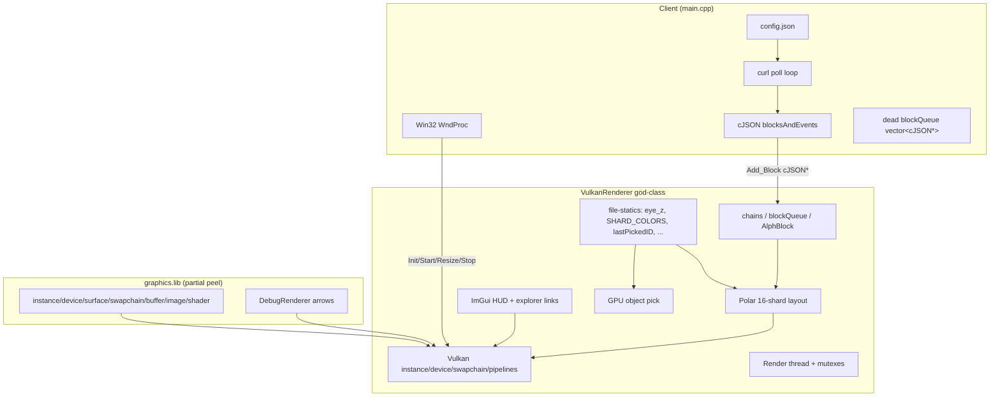
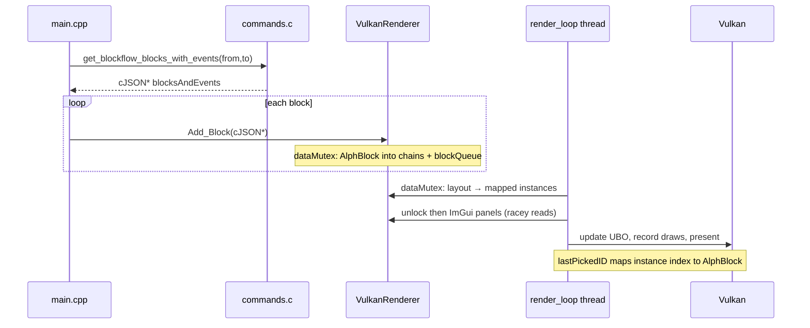
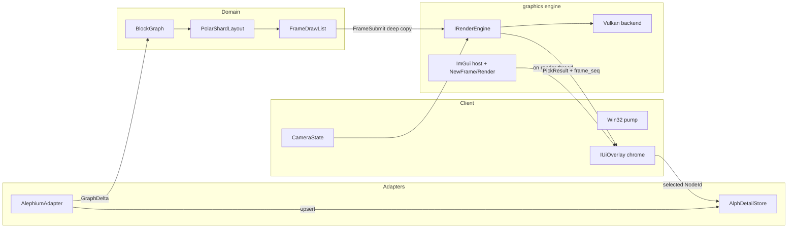
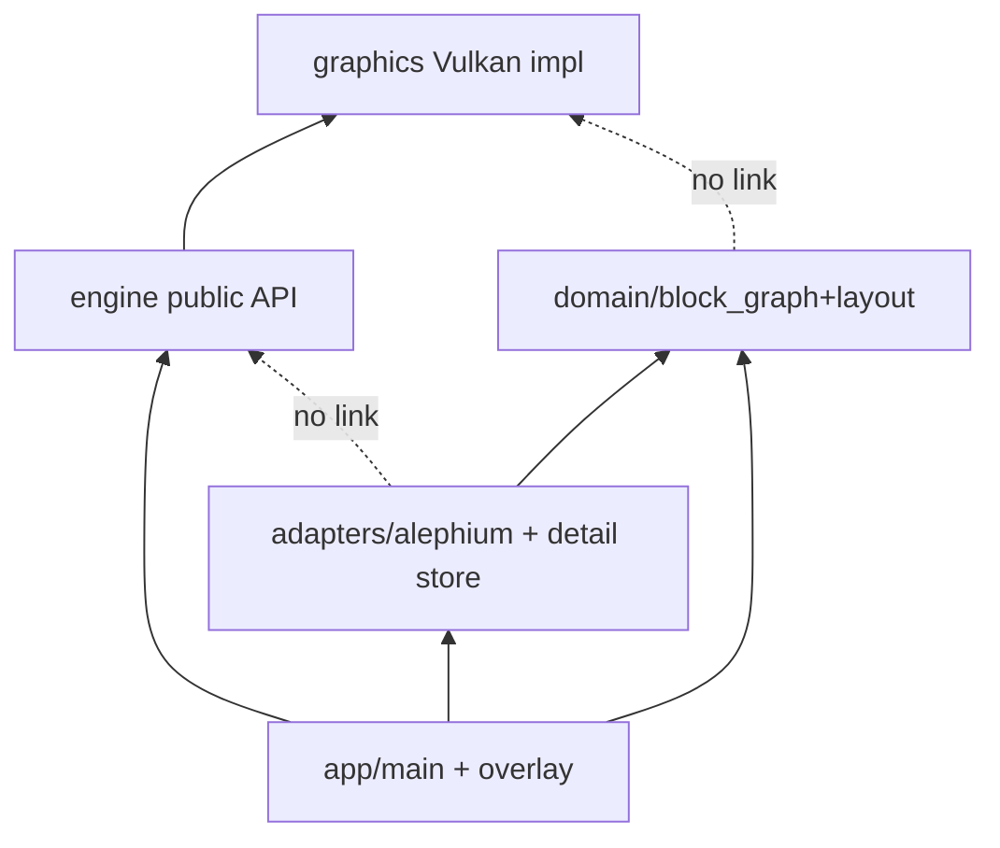
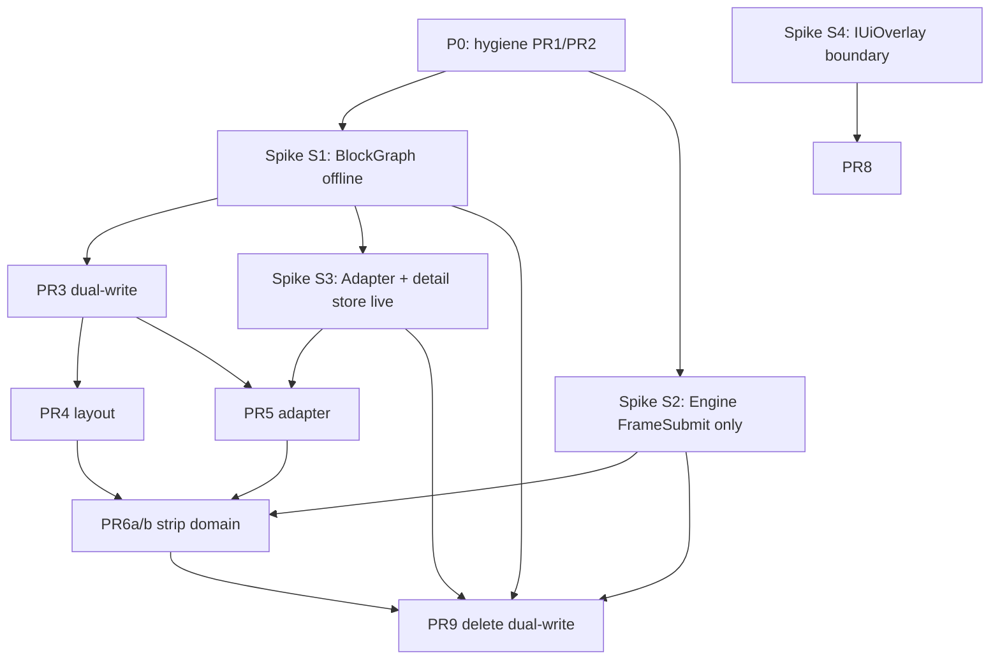
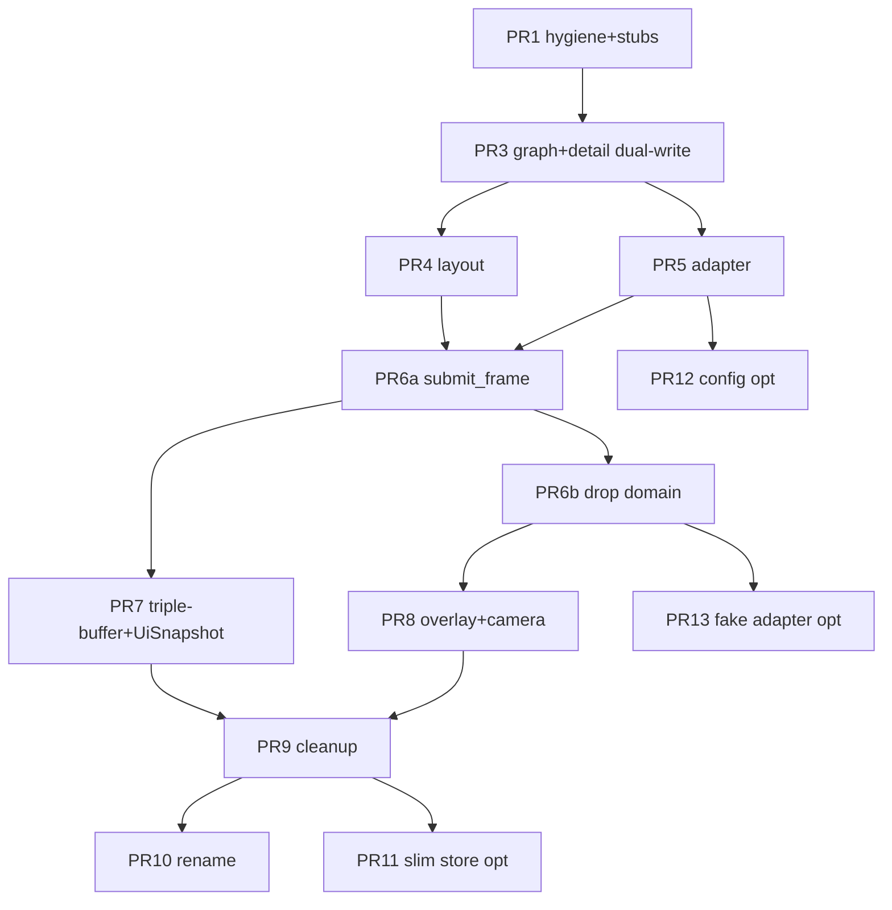

# alephium_blockviz — Graphics Engine Modularization & Multi-Chain Architecture

> **Status: HISTORICAL (landed).** Core modularization (host / domain / network / engine / graphics, detail store, slim, rename off god-class renderer) shipped.  
> **Do not treat this file as the live backlog.** Living goals and plans:  
> [`docs/layers/README.md`](layers/README.md) · [app](layers/app.md) · [engine](layers/engine.md) · [graphics](layers/graphics.md) · [network](layers/network.md).  
> Residual items from the old PR plan map roughly to: FakeChain/Debug → **network** (+ app UX); config polish → **app**; further PSO modularization → **graphics**.

| Field | Value |
|-------|--------|
| **Document** | Target architecture & incremental modularization plan |
| **Author** | _(owner)_ |
| **Date** | 2026-07-09 |
| **Status** | **Historical (landed)** — was Draft rev 2; kept for design rationale |
| **Repo** | `C:\Users\JackD\OneDrive\Desktop\alephium_blockviz` |
| **Solution** | `alephium_visualizer.sln` (app: `alephium_visualizer`, libs: `graphics`, `blockviz_engine`, `network`) |

---

## Overview

`alephium_blockviz` is a working Windows Vulkan + ImGui visualizer that polls Alephium’s blockflow API and draws blocks as instanced cubes on a 16-shard polar layout. The application runs, but nearly all concerns—GPU bootstrap, frame loop, mouse picking, domain storage, layout, UX, and Alephium JSON parsing—live inside a single god-class (`VulkanRenderer` in `src/vulkan_renderer.hpp` ~150 lines + `vulkan_renderer.cpp` ~1347 non-blank / ~1714 physical lines) plus a thin `main.cpp` poll loop.

A partial graphics peel already exists: static library `graphics` (`graphics/graphics.vcxproj`) compiles free-function helpers under `src/graphics/` (`create_instance`, `create_device`, `create_buffer`, etc.) exposed via `gpu_prv_lib.h`. Public engine surface `gpu_pub_lib.h` is empty. Domain sketches (`src/dag.hpp`, `src/alph_block.hpp`) are either underused or tightly coupled to the renderer.

This document inventories that coupling, proposes a **layered target architecture** (adapters → shared graph → layout/scene → pure graphics engine), defines **critical C++ interfaces** (including ImGui/threading, detail store, FrameSubmit lifetime, layout origin state), and lays out a **prototype-first, incremental PR path** with **explicit spike→PR gates**. Multi-chain support is planned as **one stable graph model + per-chain adapters**, not N renderers.

---

## Background & Motivation

### Current state (as built)



**Entry / client** (`src/main.cpp`):

- Win32 window + `WndProc` → `renderer.Resize()` on `WM_SIZE`; ImGui Win32 handler on main thread.
- Loads `config.json` via `load_configs()` (`src/config.c`); uses first entry’s `url` as `baseUrl` (array may hold mainnet + testnet; only `[0]` is used).
- Polls every `ALPH_TARGET_BLOCK_SECONDS` (8s) with `get_blockflow_blocks_with_events()` (`src/commands.c`).
- Initializes `lastPollTs` to `now - ALPH_LOOKBACK_WINDOW_SECONDS` (10 min); on success advances watermark; on failed parse/HTTP leaves watermark unchanged (only assigns `lastPollTs = now` inside `if (obj)`).
- Overlaps query window: `fromTs = lastPollTs - ALPH_TARGET_BLOCK_SECONDS*1000`.
- Walks nested `blocksAndEvents` arrays, extracts each `block` object, calls `renderer.Add_Block(block)`.
- Hard-coded 4×4 height helpers (`get_heights`, unused in main loop body), Esc quit, `Sleep(10)` main loop.
- Window size macros come from renderer header (`WDW_WIDTH` / `WDW_HEIGHT`).
- **Dead code:** `std::vector<cJSON*> blockQueue` is declared, never populated with live blocks, and `cJSON_Delete`’d at exit — not the renderer’s `blockQueue`.

**God-class renderer** (`VulkanRenderer`):

| Concern | Symbols / behavior |
|---------|-------------------|
| Full Vulkan | `instance`, `device`, `surface`, `swapchain`, depth, main + picker pipelines, buffers, descriptors, timeline sync, `MAX_FRAMES_IN_FLIGHT` (3) |
| Threading | `renderThread`, `renderMutex`, `dataMutex`, `dataCond`, `render_loop()` @ ~60 Hz |
| Domain | `chains` = `vector<HeightToHash>` sized to **16**; `HashToBlocks` = `map<string, AlphBlock>`; `blockQueue` deque; `selected_block` |
| Ingest | `Add_Block(cJSON*)` constructs `AlphBlock`, indexes by `chain_idx()`, uncle erasure; prints `"duplicate\n"` on emplace fail |
| Layout | Per-frame under `dataMutex`: polar coords from `shardId`, `meters_per_height`, colors from `SHARD_COLORS[16]`, session-local `start_height[16]` |
| UX | ImGui status bar + inspector **after** `dataMutex` unlock; explorer.alephium.org links; camera sliders |
| GPU pick | Second pipeline + `R32_UINT` pick image; instance index → `selected_block` via `lastPickedID` |
| Camera | `eye_z` (init `-ALPH_LOOKBACK_WINDOW_SECONDS`), `meters_per_second`, `elapsedSeconds` → UBO in `update_uniform_buffer()` |

**Partial graphics peel** (`src/graphics/`, linked as `graphics.lib`):

- Implemented: `instance.cpp`, `device.cpp`, `surface.cpp`, `swapchain.cpp`, `buffer.cpp`, `image.cpp`, `shader.cpp`, `validation.cpp`, `debug/arrow.cpp`.
- API: free functions in `gpu_prv_lib.h` (Vulkan types in signatures).
- `gpu_pub_lib.h`: **empty** — no stable public engine API yet.
- Pre-build: `compile_shaders.py` builds `.spv` from `src/graphics/shaders/*.glsl`.
- Validation layers: enabled in Debug via `validation.cpp` / instance extensions; stripped in Release (`#ifndef NDEBUG`).

**Domain sketches (underused / misplaced):**

- `src/dag.hpp` / `dag.cpp`: `map<string, cJSON*>` with `MAX_GROUPS 4`; **not on main data path** (`Dag` is compiled in vcxproj but not used from `main` or renderer).
- `src/alph_block.hpp`: full Alephium block/txn/UTXO model + poll constants (`ALPH_LOOKBACK_WINDOW_SECONDS`, `ALPH_TARGET_BLOCK_SECONDS`, `ALPH_NUM_GROUPS`).
- `src/commands.c/h`: Alephium REST command table only; global `CURL* curl` and `baseUrl`; URL buffers 128 chars.

### Pain points

1. **Cannot extract a reusable engine** — `VulkanRenderer` depends on `alph_block.hpp` / cJSON; graphics cannot be unit-tested or demoed without chain data.
2. **Layout fused with GPU upload under ingest lock** — positions written straight into mapped instance memory inside `render_loop()` while holding `dataMutex`. ImGui is **not** under that lock (see inventory).
3. **Post-unlock data races** — after `lock.unlock()`, `blockQueue` and `selected_block` are read/written on the render thread while `Add_Block` may mutate them from main under `dataMutex` only during ingest (ImGui path races).
4. **Multi-chain would require forking the renderer** unless a shared graph model is introduced first.
5. **`Dag` and `AlphBlock` diverge** — two incomplete models; main path owns rich `AlphBlock` inside the GPU class.
6. **Public API vacuum** — `gpu_pub_lib.h` empty; callers include private helpers and own half the Vulkan lifecycle.
7. **Client still knows too much about shards** — 4×4 loops and Alephium JSON shape in `main.cpp`.
8. **File-static coupling** — camera, palette, pick state live as `.cpp` statics, hard to peel into engine members vs client inputs.

### Hardware context (non-central)

Local Windows laptop (HP Victus, Ryzen AI 7 350, RTX 5060 Laptop + Radeon 860M, ~16 GB). Device selection already prefers discrete GPU (`pick_physical_device` in `device.cpp`). Dual-GPU is a deployment note, not a driver for architecture.

---

## Goals & Non-Goals

### Goals

1. **Modularize the graphics engine** so it is pure GPU: no chain types, no cJSON, no Alephium URLs.
2. **Abstract rendering from client code** — client owns window/config/network/UX; domain owns graph + layout; engine owns GPU.
3. **Enable multi-chain later** via **one stable graph model + adapters**, not N renderers.
4. **Prototype-first validation** — thin spikes before *matching* full PRs; pivot quickly on dead ends.
5. **Keep the app running** after every mergeable PR (no big-bang rewrite), including **selection inspector continuity**.
6. **Document coupling inventory** so refactors have a checklist.

### Non-Goals (explicit)

- Designing a full multi-chain product (UI for chain switcher marketplace, multi-network dashboards, etc.).
- Rewriting to another graphics API (D3D12/OpenGL/WebGPU) unless Vulkan is proven inadequate.
- Perfect ECS, plugin SDKs, or scripting.
- Production-grade networking (retries, auth, websocket streaming design) beyond extracting what exists.
- Replacing ImGui or Win32 in this design pass.
- Shipping a second chain implementation in the first modularization wave (interfaces only; Alephium remains the sole adapter).
- Solving dual-GPU presentation edge cases beyond current discrete-GPU pick.
- Structured logging frameworks (printf + ImGui remain acceptable).

---

## Inventory: Coupling Analysis

### Legend

| Tag | Meaning |
|-----|---------|
| **G** | Pure graphics (belongs in engine) |
| **S** | Scene / layout (domain→visual, chain-agnostic) |
| **D** | Domain graph (chain-agnostic) |
| **A** | Alephium-specific (adapter / client) |
| **C** | Client / platform (window, config, process) |
| **M** | Mixed today (must split) |

### Size note

| File | Approx. size |
|------|----------------|
| `vulkan_renderer.cpp` | ~1714 physical lines / ~1347 non-blank |
| `vulkan_renderer.hpp` | ~179 physical lines / ~150 non-blank |
| Combined god-class surface | **~1.5–1.9k LOC** (doc previously understated as “~1.3k”) |

### `VulkanRenderer` member / method inventory

| Item | Location | Tag | Notes |
|------|----------|-----|-------|
| `Init/Start/Stop/Resize` | public API | **M** | Should become engine lifecycle + client resize hook |
| `Add_Block(cJSON*)` | public | **A** | Must leave engine; becomes adapter → graph + detail store |
| `VertexNormal`, `CUBE_*` | mesh | **G** | Engine mesh primitive or asset |
| `InstanceData { pos, color }` | draw | **G**/**S** | Engine draws; scene fills — **no per-instance scale today** |
| `UniformBufferObject` | shaders | **G** | Camera/lighting; filled from client/camera state in target |
| `PushConstants` mouse pick | picker | **G** | Engine feature; selection ID is opaque |
| Vulkan handles / swapchain / pipelines | private | **G** | Engine core |
| `renderThread`, mutexes, cond | threading | **G** | **v1: engine-owned render thread** (K8/K15) |
| `chains`, `HeightToHash`, `HashToBlocks` | domain | **D**/**A** | Structure is sharded; values are full `AlphBlock` (incl. txns) |
| `blockQueue`, `total_blocks` | UX feed | **D**/**C** | Recent-blocks UI list; race after unlock today |
| `selected_block: AlphBlock` | selection | **A**/**D** | Holds full txn detail for inspector |
| Layout polar + palette | `render_loop` | **S**/**A** | Layout reusable; 16-lane palette is presentation |
| `start_height[16]` | local in `render_loop` | **S** | Session-local Z origin per lane — **must be layout state** |
| ImGui “Blockflow” / explorer links | `render_loop` | **C**/**A** | Client/UX; runs **after** `dataMutex` unlock |
| `DebugRenderer` arrows | camera debug | **G** | Already mostly pure; lives in graphics lib |
| Uses `create_*` from `gpu_prv_lib.h` | Init | **G** | Good; incomplete peel |

### File-static / free-function state in `vulkan_renderer.cpp` (must re-home)

| Symbol | Tag | Target home |
|--------|-----|-------------|
| `lastPickedID` | **G**/**C** | Engine pick result → client maps index |
| `SHARD_COLORS[16]` | **A**/**S** | `LanePalette` in layout params / adapter theme |
| `meters_per_height` | **S** | `LayoutParams` |
| `meters_per_second`, `eye_z` | **C** | `CameraState` owned by client (sliders in UI overlay) |
| `debugRender` | **G** | Engine member |
| `s_resized` | **G** | Engine member |
| `pickMouseX/Y` | **G** | Engine pick query |
| `viewProj` | **G** | Engine (debug arrows) |
| `statusBarHeight` | **C** | App UI layout constant |
| `pipeline_barrier` helper | **G** | Engine private |

### Pick input path (today)

- In `record_command_buffer`, after main draw + ImGui draw data:
  - Reads `ImGuiIO`; if `io.WantCaptureMouse && io.MouseClicked[Left]` then records picker pass.
  - Comment says “outside ImGui UI” but the condition requires `WantCaptureMouse` — **inverted vs typical “pick when UI does not capture”**. Treat as existing bug/behavior to preserve or fix deliberately during engine peel (document, don’t silently “fix” without smoke-testing selection).

### Mutex scope (corrected)

```text
render_loop frame:
  lock dataMutex
    rebuild InstanceData[] into mappedInstanceMemory from chains   // layout+upload
    // also may set selected_block from lastPickedID while locked
  unlock dataMutex

  ImGui NewFrame already started earlier; build Blockflow + Block panels  // NOT under dataMutex
    reads blockQueue, selected_block, total_blocks  // RACE with Add_Block
  update_uniform_buffer(); render();
```

| What | Under `dataMutex`? |
|------|--------------------|
| Layout + instance memcpy | **Yes** |
| ImGui windows / explorer UI | **No** |
| `Add_Block` mutations | **Yes** (on main thread) |
| `blockQueue` / `selected_block` UI reads | **No** → **existing races** |

### File-level coupling matrix

| File | Depends on | Tag | Role today |
|------|------------|-----|------------|
| `src/main.cpp` | curl, cJSON, commands, config, `VulkanRenderer`, Win32 | **C**+**A** | Window + poll + push blocks; dead `blockQueue` vector |
| `src/vulkan_renderer.*` | Vulkan, glm, ImGui, alph_block, cJSON, gpu_prv, arrow | **M** | God object + file-statics |
| `src/alph_block.hpp` | cJSON, commands macros | **A** | Alephium model (hot + detail) |
| `src/commands.c/h` | curl, cJSON | **A** | HTTP API |
| `src/config.c/h` | cJSON | **C** | Config load |
| `src/dag.*` | cJSON | **D** (stub) | Unused map |
| `src/graphics/*` | Vulkan only | **G** | Helpers |
| `src/graphics/debug/arrow.*` | Vulkan, glm, gpu_prv | **G** | Debug draw |
| ImGui sources in vcxproj | Vulkan/Win32 backends | **C**/**G** | UI — host in engine v1, chrome via overlay |

### Data flow today (critical path)



### What is already pure graphics (keep / grow)

- Free functions: `create_instance`, `destroy_instance`, `create_debug_messenger`, `create_win32_surface`, `pick_physical_device`, `create_device`, `create_swapchain`, `create_buffer` / `destroy_buffer`, `create_image` / views, `load_shader_source` / `create_shader_module`.
- Shader set: `vert.spv` / `frag.spv` (instanced lit cubes; **pos+color only**, uniform `ubo.meters`), `picker_*.spv`, `arrow_*.spv`, `color_frag.spv`.
- Timeline + dynamic rendering (Vulkan 1.3 features enabled in `create_device`).
- Instanced draw path: cube mesh + `InstanceData` buffer + UBO.

### What is Alephium-specific inside the renderer (must exit)

- `#include "alph_block.hpp"` and all `AlphBlock` storage (including txn-rich selection).
- `Add_Block(cJSON*)`.
- `chains` sized to 16; `chainFrom`/`chainTo`/`chain_idx()`.
- Uncle removal loop over ghost uncles.
- `SHARD_COLORS[16]` and explorer.alephium.org URLs in ImGui.
- Timing constants from `ALPH_*` used for camera init and layout scale.

---

## Target Architecture

### Layering principle

```
Chain adapters → BlockGraph (normalize) → Scene / layout → Graphics engine
                 ↘ AlphDetailStore (v1, adapter-owned)
```

| Layer | Owns | Must not own |
|-------|------|--------------|
| **Client** | Win32 window, message pump, config, process lifetime, `CameraState`, wiring, ImGui **chrome content** via overlay | Vulkan details, chain JSON schemas inside engine |
| **Adapters** | HTTP, parse chain-native payloads → `GraphDelta` + **detail store upserts** | Drawing, GPU resources |
| **BlockGraph** | Nodes, optional edges, indices, retention, thread-safe ingest | cJSON, Vulkan, screen positions, txn lists |
| **Detail store** | Full `AlphBlock` (or equivalent) keyed by `NodeId` for inspector | GPU types |
| **Scene / Layout** | Positions, colors, stable instance order, lane origin heights | Device creation, swapchain |
| **Graphics engine** | Instance/device/swapchain, pipelines, frame buffers, pick indices, ImGui Vulkan host | Chain types, cJSON, explorer URLs, `AlphBlock` |



### Ownership & threading model (target) — decided for v1

| Thread | Responsibilities |
|--------|------------------|
| **Main** | Win32 messages (`ImGui_ImplWin32_WndProcHandler`), config, `adapter.poll` → `graph.apply` + detail store, build `FrameDrawList`, `engine->submit_frame` (deep copy), `resize`/`stop` |
| **Render (engine-owned)** | Wait timeline → swap published frame buffer → ImGui `NewFrame` → **call `IUiOverlay::draw()`** → upload instances/camera → record → pick if requested → submit → present |

**v1 decision (closes former OQ6):** Keep **engine-owned render thread** (`start`/`stop`) to match current code. Client-driven `render_frame()` is a future option only if testing pain demands it.

**Boundary rules:**

1. Adapters never touch `Vk*` or engine types.
2. Engine never includes adapter or `alph_block` headers.
3. `BlockGraph` is the single source of truth for **block identity / layout inputs**; **txn detail** lives in `AlphDetailStore` (adapter-owned in v1).
4. Each `submit_frame` **deep-copies** into an internal slot with a **monotonic `frame_seq`**. Render thread never reads live graph.
5. `IUiOverlay::draw()` runs **on the render thread** and must only touch **snapshot/shared atomics / mutex-protected read-only views** (e.g. last published `UiSnapshot` from main: recent ids, selected id, detail copy for selection).
6. Pick indices are valid only for the **GPU-visible frame’s** instance order (`PickResult.frame_seq` must match client’s mapping table for that seq, or client keeps last N maps).

### Suggested physical layout (target tree)

```
src/
  app/                 # main, Win32, IUiOverlay impl, CameraState
  config/              # config.c/h (keep or thin C++ wrapper)
  domain/
    block_graph.hpp
    layout.hpp
    scene.hpp          # FrameDrawList helpers, stable sort
  adapters/
    alephium/          # alph_block, commands, AlephiumAdapter, AlphDetailStore
  engine/
    include/engine/    # IRenderEngine, types (no chain)
  graphics/            # existing peel → engine impl detail
```

Build: keep MSVC solution; grow `graphics` static lib; **set `/std:c++17` minimum** (or C++20 if `std::span` desired — see Build). Do not link curl/cjson into `graphics`.

---

## Critical Interfaces

These are **target** headers — not present yet.

### 1. Shared graph model (`domain/block_graph.hpp`)

```cpp
// Chain-agnostic. No cJSON. No Vulkan. No txn lists.
#pragma once
#include <cstdint>
#include <string>
#include <vector>
#include <optional>
#include <unordered_map>
#include <shared_mutex>

using NodeId = std::string;   // typically block hash; adapters normalize

enum class EdgeKind : uint8_t {
    Parent,
    Dependency,   // e.g. Alephium deps[]
    Uncle,
    Reference
};

struct GraphNode {
    NodeId id;
    int64_t timestamp_ms = 0;
    int64_t height = -1;
    uint32_t group_from = 0;      // Alephium: chainFrom; linear: 0
    uint32_t group_to = 0;        // Alephium: chainTo; linear: 0
    uint32_t lane = 0;            // e.g. chainFrom*4+chainTo
    uint32_t lane_count_hint = 1; // e.g. 16 for Alph, 1 for linear
    std::string chain_label;      // optional UI tag
    // NO txn/UTXO vectors here (see AlphDetailStore / K14)
};

struct GraphEdge {
    NodeId from;
    NodeId to;
    EdgeKind kind = EdgeKind::Dependency;
};

struct GraphDelta {
    std::vector<GraphNode> upsert_nodes;
    // Edges optional in v1 (OQ3): may be empty until edge visualization is chosen
    std::vector<GraphEdge> upsert_edges;
    std::vector<NodeId> remove_nodes;   // uncle eviction, etc.
};

class BlockGraph {
public:
    void apply(const GraphDelta& delta);
    bool contains(const NodeId& id) const;
    std::optional<GraphNode> get(const NodeId& id) const;
    std::vector<GraphNode> nodes_snapshot() const; // sorted copy for layout
    std::vector<GraphEdge> edges_from(const NodeId& id) const;
    void prune(int64_t min_timestamp_ms, size_t max_nodes);

    // Dual-write validation helpers
    size_t node_count() const;
    std::vector<NodeId> live_ids_sorted() const;

private:
    mutable std::shared_mutex mu_;
    std::unordered_map<NodeId, GraphNode> nodes_;
    std::unordered_map<NodeId, std::vector<GraphEdge>> out_edges_;
};
```

**v1 edges:** PR3 may ship **nodes-only** deltas (`upsert_edges` empty). Edge storage is allowed but not required until OQ3 decides visualization.

**Rationale vs current `chains`:** flat nodes + `lane` avoid hard-coding 16-way containers.

**Rationale vs `Dag`:** replace; do not store `cJSON*`.

### 2. Detail continuity — `AlphDetailStore` (mandatory before engine drops `AlphBlock`)

```cpp
// adapters/alephium/alph_detail_store.hpp
#pragma once
#include "alph_block.hpp"
#include "domain/block_graph.hpp"
#include <unordered_map>
#include <mutex>
#include <optional>

// v1: populated at parse time alongside GraphDelta (not lazy fetch).
// Ensures inspector never loses txn/UTXO data when renderer stops storing AlphBlock.
class AlphDetailStore {
public:
    void upsert(const AlphBlock& block);          // by block.hash
    void remove(const NodeId& id);                // uncle eviction / prune
    void remove_many(const std::vector<NodeId>&);
    std::optional<AlphBlock> get(const NodeId& id) const;
    // Thread-safe: main writes on poll; UI overlay may copy selected detail under mutex
    AlphBlock get_or_empty(const NodeId& id) const;

private:
    mutable std::mutex mu_;
    std::unordered_map<NodeId, AlphBlock> by_id_;
};
```

**v1 policy (K14 refined):**

- Hot `GraphNode` = metadata only.
- **At parse time**, adapter upserts full `AlphBlock` into `AlphDetailStore` (same moment as `GraphDelta` nodes).
- Selection UI: `NodeId` → `detail_store.get(id)` (no network required for already-polled blocks).
- Optional later: `fetch_detail` for sparse/historical blocks not in store.
- PR that removes `AlphBlock` from the renderer **must not land** without this store already feeding the inspector.

### 3. Chain adapter (`adapters/chain_adapter.hpp`)

```cpp
#pragma once
#include "domain/block_graph.hpp"
#include <string>

struct AdapterConfig {
    std::string base_url;
    int64_t lookback_window_ms = 10 * 60 * 1000;  // ALPH_LOOKBACK_WINDOW_SECONDS
    int64_t poll_interval_ms   = 8 * 1000;        // ALPH_TARGET_BLOCK_SECONDS
    int64_t overlap_ms         = 8 * 1000;        // one block interval overlap
};

class IChainAdapter {
public:
    virtual ~IChainAdapter() = default;
    virtual const char* chain_id() const = 0;
    virtual void configure(const AdapterConfig& cfg) = 0;

    // On success: advances last_success_to_ts to now_ms; returns delta (may be empty).
    // On failure: leaves watermark unchanged; returns empty delta (caller keeps last graph).
    virtual GraphDelta poll(int64_t now_ms) = 0;

    // Optional remote hydrate (not required for v1 inspector if store is warm)
    virtual bool fetch_detail(const NodeId& id, std::string& /*out*/) { (void)id; return false; }
};
```

**Alephium adapter poll watermark policy (mirror today’s success-only advance):**

| Field | Meaning |
|-------|---------|
| `last_success_to_ts` | End of last successful poll window (ms); init `now - lookback` on first configure/start |
| Request range | `[last_success_to_ts - overlap_ms, now_ms]` |
| Success | Parse → build `GraphDelta` + detail upserts → set `last_success_to_ts = now_ms` |
| Failure (null JSON / HTTP error) | **Do not** advance watermark; log; return empty delta |
| Idempotency | `BlockGraph` upsert by hash; duplicate hashes no-op (same as `emplace` + `"duplicate\n"`) |
| Uncle eviction | `remove_nodes` for uncle hashes removed from live set; also `detail_store.remove` |

**Also owns:** mapping `chainFrom/chainTo` → `lane`, `lane_count_hint = 16`, default `LanePalette` export for layout (or document that layout uses the fixed 16-color table ported from `SHARD_COLORS`).

### 4. Scene / layout (`domain/layout.hpp`)

```cpp
#pragma once
#include "domain/block_graph.hpp"
#include <glm/glm.hpp>
#include <vector>
#include <array>
#include <cstdint>
#include <unordered_map>

// v1: no per-instance scale (vert.glsl / InstanceData are pos+color only).
struct VisualInstance {
    NodeId id;
    glm::vec3 position;
    glm::vec3 color;
};

struct FrameDrawList {
    uint64_t layout_seq = 0;              // bumps each build
    std::vector<VisualInstance> instances; // stable order: sort by NodeId for pick coherence
    std::vector<NodeId> pick_index_to_node; // parallel to instances (redundant with id field; keep explicit)
    // edges optional — empty until OQ3
    struct Segment { glm::vec3 a, b; glm::vec4 color; };
    std::vector<Segment> edges;
};

// Palette: exact parity with file-static SHARD_COLORS[16] for Alephium
struct LanePalette {
    static constexpr size_t kMax = 16;
    std::array<glm::vec3, kMax> colors; // initialize to current SHARD_COLORS literals
    glm::vec3 color_for(uint32_t lane) const {
        return colors[lane % kMax];
    }
};

struct LayoutParams {
    float meters_per_height = 8.f;  // ALPH_TARGET_BLOCK_SECONDS
    float base_radius = 20.f;
    LanePalette palette;            // default = port of SHARD_COLORS
};

class ILayout {
public:
    virtual ~ILayout() = default;
    virtual FrameDrawList build(const BlockGraph& graph, const LayoutParams& p) = 0;
    virtual void reset_session_origins() = 0; // clear start_height-like state
};

// Port of current polar layout — STATEFUL
class PolarShardLayout final : public ILayout {
public:
    FrameDrawList build(const BlockGraph& graph, const LayoutParams& p) override;
    void reset_session_origins() override { origin_height_by_lane_.clear(); }

private:
    // Session-local: first-seen height per lane → Z origin (mirrors start_height[16])
    std::unordered_map<uint32_t, int64_t> origin_height_by_lane_;
    uint64_t seq_ = 0;
};
```

**Layout math (parity):**

```text
// origin = origin_height_by_lane_[lane]; if missing, set to node.height on first sight
angle  = (lane / lane_count_hint) * 2π
radius = base_radius + block_index_within_height_lane * meters_per_height
z      = -(height - origin) * meters_per_height
color  = palette.color_for(lane)
```

**Stable instance order (acceptance for PR4+):** after building instances, **sort by `NodeId` ascending** (or assign sticky `pick_id` integer). Do not rely on `unordered_map` / nested `map` iteration order alone without documenting it. Today’s order is map iteration; target prefers explicit sort so pick mapping is reproducible.

**Who calls `build` during migration:**

| Phase | Caller |
|-------|--------|
| PR4 (layout extract, domain still in renderer) | `VulkanRenderer::render_loop` calls `layout_.build(graph_, params)` under or after taking a **graph snapshot**, still before GPU upload |
| PR6a+ (submit_frame path) | **Main thread** builds `FrameDrawList` and `submit_frame`s it |

### 5. Graphics engine public API

**Language:** v1 public headers **avoid `std::span`** so they compile without forcing C++20. Prefer:

```cpp
struct FrameSubmit {
    const GpuInstance* instances = nullptr;
    size_t instance_count = 0;
    CameraUBO camera{};
    uint64_t frame_seq = 0;     // client-assigned or engine-assigned on copy
    // optional: const ArrowDesc* arrows; size_t arrow_count;
};
```

Hygiene PR may set `/std:c++17` on both vcxproj files. C++20/`std::span` is optional later.

```cpp
#pragma once
#include <cstdint>
#include <glm/glm.hpp>

struct EngineCreateInfo {
    void* platform_instance;  // HINSTANCE
    void* window;             // HWND
    uint32_t width;
    uint32_t height;
    bool enable_validation = true; // Debug default true
};

struct CameraUBO {
    glm::mat4 view;
    glm::mat4 proj;
    glm::vec3 light_pos;
    float pad1;
    glm::vec3 view_pos;
    float pad2;
    float meters;  // matches vert.glsl ubo.meters
};

struct GpuInstance {
    glm::vec3 pos;
    glm::vec3 color;
    // no scale in v1
};

struct FrameSubmit {
    const GpuInstance* instances = nullptr;
    size_t instance_count = 0;
    CameraUBO camera{};
    uint64_t client_seq = 0; // correlates with pick map
};

struct PickQuery {
    uint32_t mouse_x;
    uint32_t mouse_y;
};

struct PickResult {
    bool hit = false;
    uint32_t instance_index = ~0u;
    uint64_t frame_seq = 0;  // which submitted frame was GPU-visible
};

// App chrome drawn on the RENDER THREAD between ImGui::NewFrame and ImGui::Render
class IUiOverlay {
public:
    virtual ~IUiOverlay() = default;
    virtual void draw() = 0; // ImGui::* calls only; no Vulkan
};

class IRenderEngine {
public:
    virtual ~IRenderEngine() = default;

    virtual void initialize(const EngineCreateInfo& info) = 0;
    virtual void resize(uint32_t width, uint32_t height) = 0;
    virtual void shutdown() = 0;

    virtual void start() = 0;  // starts engine-owned render thread
    virtual void stop() = 0;   // joins thread; safe after last submit

    // Thread-safe from main: deep-copy into next publish slot (triple buffer preferred).
    // If called multiple times per GPU frame, latest copy wins (drop intermediate).
    // Pointers in FrameSubmit need only live for the duration of this call.
    virtual void submit_frame(const FrameSubmit& frame) = 0;

    virtual void set_ui_overlay(IUiOverlay* overlay) = 0; // nullptr = none; not owned

    virtual void request_pick(const PickQuery& q) = 0;
    virtual bool consume_pick(PickResult& out) = 0; // true if a new result available
};

IRenderEngine* create_vulkan_engine();
void destroy_render_engine(IRenderEngine*);
```

#### FrameSubmit / pick lifetime rules

1. **Deep copy:** `submit_frame` copies `instance_count * sizeof(GpuInstance)` + `CameraUBO` + `client_seq` into a free slot; returns after copy (does not retain caller pointers).
2. **Buffering:** at least double-buffer; **triple-buffer** recommended so main never blocks on GPU. Slots: `writing`, `pending`, `gpu_reading`.
3. **Latest wins:** multiple submits before next GPU frame → only newest `pending` is swapped in.
4. **resize / stop:** `resize` may flag swapchain recreate on render thread; `stop` waits idle then joins — no submit after `stop` begins.
5. **Pick coherence:** when picker runs, it records against the **currently bound instance buffer** for that command buffer. `PickResult.frame_seq` = that buffer’s `client_seq`. Client must map `instance_index` using the `pick_index_to_node` from the `FrameDrawList` with the same seq (keep a small ring of recent maps, e.g. last 3).
6. **Stable order:** enforced by layout sort so re-layout without set change does not scramble indices unnecessarily.

#### ImGui contract (K8)

| Step | Thread | Owner |
|------|--------|-------|
| `ImGui_ImplWin32_WndProcHandler` | Main | Client `WndProc` |
| `ImGui_ImplVulkan_Init` / Shutdown | Engine init/shutdown | Engine |
| `ImGui_ImplVulkan_NewFrame` + `ImGui_ImplWin32_NewFrame` + `ImGui::NewFrame` | **Render** | Engine |
| `IUiOverlay::draw()` | **Render** | App implementation |
| `ImGui::Render` + `ImGui_ImplVulkan_RenderDrawData` | **Render** | Engine |
| Camera sliders in overlay | **Render** | Mutate `CameraState` under mutex; main reads for next `submit_frame` **or** overlay writes camera directly into a side channel the engine merges (prefer shared `CameraState` with mutex — K15) |

**Target main does *not* call ImGui::NewFrame on main.** Pseudocode below reflects that.

### 6. Client wiring (target shape)

```cpp
// Pseudocode — v1
CameraState camera; // eye_z, meters_per_second, mutex
UiSnapshot  ui_snap; // recent NodeIds, selected, detail copy — published by main

class AppOverlay : public IUiOverlay {
  void draw() override {
    // read ui_snap / camera under locks; ImGui sliders write camera
    // inspector uses AlphDetailStore copy from snapshot, not live adapter
  }
};

auto engine = create_vulkan_engine();
engine->initialize({ hInstance, hwnd, w, h });
AppOverlay overlay{...};
engine->set_ui_overlay(&overlay);
engine->start();

BlockGraph graph;
PolarShardLayout layout;
AlphDetailStore details;
AlephiumAdapter adapter{details};
adapter.configure({ baseUrl });

uint64_t seq = 0;
std::array<std::vector<NodeId>, 3> pick_maps;
while (running) {
  pump_win32(); // ImGui Win32 handler only
  if (poll_due) {
    auto delta = adapter.poll(now_ms); // also upserts details
    graph.apply(delta);
    graph.prune(...);
  }
  FrameDrawList dl = layout.build(graph, params);
  // stable sort already inside build
  pick_maps[seq % 3] = dl.pick_index_to_node;
  CameraUBO cam = camera.to_ubo(aspect);
  std::vector<GpuInstance> gpu = to_gpu(dl);
  engine->submit_frame({ gpu.data(), gpu.size(), cam, seq });
  publish_ui_snapshot(ui_snap, graph, details, selected);

  PickResult pr;
  if (engine->consume_pick(pr) && pr.hit) {
    auto& map = pick_maps[pr.frame_seq % 3];
    if (pr.frame_seq matches map epoch) selected = map[pr.instance_index];
  }
  ++seq;
  Sleep(10);
}
engine->stop();
engine->shutdown();
```

### Interface dependency rules



---

## Proposed Design (detailed)

### Phase model + spike→PR gates (corrected)



| Gate | Required before |
|------|-----------------|
| **S1 pass** | Merge **PR3** (dual-write graph) |
| **S2 pass** | Merge **PR6a** (`submit_frame` path / engine-only draw validation) |
| **S3 pass** | Merge **PR5** (live adapter); also required before **PR6b** (delete `Add_Block`) so detail store + poll path exist |
| **S4 pass** | Merge **PR8** (overlay extraction) |
| **S1+S2+S3 green** | Merge **PR9** (delete dual-write / dead structures) |

There is **no** blanket “all spikes before PR3+”. Low-risk dual-write proceeds after S1 alone.

### Graphics engine modularization strategy

1. Complete peel bottom-up; keep `gpu_prv_lib.h` private.
2. Publish real public API (`IRenderEngine`).
3. **Snapshot + double/triple buffer:** layout produces CPU vectors; engine deep-copies — **do not** write layout output into mapped GPU memory under the ingest lock.
4. Pick returns index + `frame_seq` only.
5. ImGui host in engine; chrome via `IUiOverlay` on render thread (K8).

### Domain: BlockGraph + DetailStore as replacement for `chains` + `Dag`

| Current | Target |
|---------|--------|
| `vector<HeightToHash> chains` (16) | `BlockGraph` nodes with `lane` |
| Full `AlphBlock` in renderer maps | Metadata in graph; **full block in `AlphDetailStore`** |
| `Dag` cJSON map | delete |
| `blockQueue` for UI | `RecentIndex` / `UiSnapshot` (`deque<NodeId>`) |

### Layout

See interfaces: **stateful** `origin_height_by_lane_`, palette from `LanePalette` (port of `SHARD_COLORS`), no v1 scale.

### Multi-chain path

Unchanged principle: second adapter → same graph; engine untouched.

### Build system (near term)

- Keep `alephium_visualizer.sln` + `graphics` static lib + vcpkg (`curl`, `cjson`, `glm`).
- **Early hygiene:** set `<LanguageStandard>stdcpp17</LanguageStandard>` (or `stdcpp20` if adopting span later) on **both** app and graphics vcxproj — currently unspecified.
- `graphics` must not link curl/cjson.
- Debug: validation layers via existing `validation.cpp` (`#ifndef NDEBUG`); Release strips messenger.

---

## API / Interface Changes

### Public app-facing API today

```cpp
class VulkanRenderer {
public:
    void Init(void *hInstance, void *hwnd);
    void Add_Block(cJSON* block);  // domain + detail leak
    void Resize();
    void Start();
    void Stop();
};
```

### Target app-facing API

```cpp
IRenderEngine* create_vulkan_engine();
// + BlockGraph, ILayout, IChainAdapter, AlphDetailStore, IUiOverlay
// No Add_Block on engine.
```

### Migration shims

| Stage | Shim |
|-------|------|
| PR3–PR5 | `Add_Block` dual-writes graph + detail store; chains remain source for draw |
| PR6a | `submit_frame` path available **beside** `Add_Block`; main may still call `Add_Block` |
| PR6b | Delete `Add_Block` / domain types from engine |

---

## Data Model Changes

### From

```text
cJSON block
  → AlphBlock (full, incl. txns)
    → chains[chain_idx][height][hash]   // renderer
    → blockQueue (UI)
    → InstanceData {pos,color}          // pick via index
```

### To

```text
cJSON block (adapter only)
  → GraphDelta (nodes; edges optional)
  → AlphDetailStore[id] = AlphBlock     // mandatory for inspector
  → BlockGraph
    → FrameDrawList (stable order)
      → FrameSubmit deep copy → engine
```

### Migration strategy

1. **PR3:** dual-write `BlockGraph` + **start `AlphDetailStore`** from the same parse as `Add_Block`; validate live hash sets (not counts alone).
2. **PR4:** layout from graph with `origin_height_by_lane_` + `LanePalette`; call site still renderer.
3. **PR5:** adapter owns poll watermark + parse; still fills detail store.
4. **PR6a:** `submit_frame` path; inspector already uses detail store by `NodeId`.
5. **PR6b:** remove `AlphBlock` from engine; selection is `NodeId` only.
6. **PR11 (optional):** slim store (drop bulk txn copies for unselected nodes) only **after** store is sole detail path — not the first introduction of the store.
7. Drop `Dag` and main’s dead `vector<cJSON*> blockQueue`.

### Dual-write acceptance (stronger than count)

| Check | Pass criteria |
|-------|----------------|
| Live hash set | Sorted list of hashes in `chains` == `graph.live_ids_sorted()` after each `Add_Block`/poll |
| Uncle eviction | Removing an uncle from `chains` produces `remove_nodes` containing that hash; detail store removes too |
| Lane/height | For each live node, `lane == chain_idx()` and `height` match |
| Layout instance count | `layout.build` count == cubes that would have been emitted from `chains` |
| Debug toggle | Optional `BLOCKVIZ_DUALWRITE_ASSERT` flashes/logs first mismatch |

### Storage estimates

| Item | Estimate |
|------|----------|
| GraphNode metadata | ~100–200 B/node |
| AlphDetailStore full blocks | larger (txns); acceptable for lookback-scale node counts |
| 10 min lookback ~1–2k nodes | hundreds of KB metadata; detail dominates if all txns kept |
| Instance buffer `MAX_INSTANCES` 1M × 24 B | ~24 MB reserved — right-size later |
| FrameSubmit triple buffer | 3 × active_instances × 24 B CPU side |

---

## Alternatives Considered

### Alternative A — “Clean VulkanRenderer in place”

| Pros | Cons |
|------|------|
| Minimal churn | Domain remains in renderer; multi-chain blocked |

**Reject as end state**; OK as intermediate steps.

### Alternative B — Full ECS

**Reject for now** — overkill.

### Alternative C — N renderers per chain

**Reject** — contradicts multi-chain goal.

### Alternative D — One graph model + adapters (chosen)

**Accept.** Edges may be deferred (nodes-first PR3).

### Alternative E — Immediate CMake + GLFW rewrite

**Reject** until engine boundary is stable on Win32.

---

## Security & Privacy Considerations

| Topic | Assessment |
|-------|------------|
| **Threat model** | Local desktop tool; public HTTPS APIs; not a wallet; no private keys |
| **Network** | User-configured URLs in `config.json` |
| **Data handling** | Public chain data; avoid verbose address/tx logging |
| **Supply chain** | vcpkg: curl, cjson, glm |
| **Injection** | Remote JSON via cJSON; `commands.c` URL buffers 128 chars — watch truncation |
| **ImGui** | Clipboard hash copy is fine |
| **Validation layers** | Debug builds enable Khronos validation via `validation.cpp` / instance setup; Release strips debug messenger (`#ifndef NDEBUG`) |

No auth redesign required for this architecture pass. Structured logging remains a non-goal (printf/ImGui).

---

## Observability

### Current

- `printf` for poll counts, duplicates, HTTP errors, device name.
- ImGui totals/bps; no structured metrics.

### Target (lightweight)

| Signal | Where | How |
|--------|-------|-----|
| Poll latency / block count | adapter | log + ImGui |
| Graph node counts + dual-write mismatch | domain | log / assert |
| Instance count / upload bytes | engine | ImGui or console |
| Frame time / GPU wait | engine | existing QPC loop |
| Pick hit + frame_seq | engine | debug |
| Validation layers | graphics | Debug-only (`validation.cpp`) |

**Alerting:** N/A; prefer non-fatal poll failures (keep last graph + detail).

---

## Prototype-First Validation Plan

### Spike S1 — BlockGraph offline (½–1 day)

- `BlockGraph` + `GraphDelta` (nodes; edges optional).
- Synthetic 16-lane nodes; uncle `remove_nodes` unit check.
- **Pass:** 10k deltas < 50 ms; prune works; no Vulkan link.  
- **Unlocks:** PR3.

### Spike S2 — Engine-only draw (1–2 days)

- Hardcoded `FrameSubmit`; `start/stop/resize/pick` with `frame_seq`.
- **Pass:** ~60 FPS; pick returns index+seq; **zero** `alph_block`/cJSON in engine TU.  
- **Unlocks:** PR6a.

### Spike S3 — AlephiumAdapter + detail store (1 day)

- Poll watermark policy; `GraphDelta` + `AlphDetailStore` upserts.
- Inspector can show txns via store **without** renderer `AlphBlock`.
- **Pass:** live net visual + selection inspector.  
- **Unlocks:** PR5 merge quality; required before PR6b.

### Spike S4 — IUiOverlay (½ day)

- Explorer strings only in app overlay TU.  
- **Unlocks:** PR8.

### Dead-end / pivot triggers

| Signal | Sev | Pivot |
|--------|-----|-------|
| Layout still requires mapped GPU memory under ingest lock | High | Snapshot first (PR4/PR7) |
| Pick index wrong after reorder | High | Stable sort + `frame_seq` maps (PR4/PR6a) |
| Inspector empty after domain peel | Critical | Detail store before PR6b (mandatory) |
| UI overlay data races | High | `UiSnapshot` publish from main |
| `lane`/`group` insufficient for next chain | Med | Extend graph; not engine |
| Dual-write hash sets diverge | High | Fix delta builder before deleting chains |

---

## Risks & Mitigations

| Risk | Sev | Mitigation |
|------|-----|------------|
| Big-bang rewrite stalls project | High | Incremental PRs; split PR6; spikes with mapped gates |
| Lose selection UX at PR6 | Critical | Mandatory `AlphDetailStore` before PR6b |
| Leaking cJSON into engine | High | S2 gate; include hygiene |
| Existing `blockQueue`/`selected_block` races | High | Snapshot/`UiSnapshot` as part of dual-write/layout work — not only “double-buffer GPU” |
| Layout origin state forgotten | Med | `origin_height_by_lane_` in PR4 acceptance |
| Pick/frame desync | High | `frame_seq` + ring of pick maps |
| Over-abstract multi-chain | Med | Alephium-only adapter; optional edges |
| `queueFamilyIndex = 0` | Med | Note for later robustness |
| MSVC language standard unspecified | Low | Hygiene sets C++17 |

---

## Rollout Plan

### Principles

1. Spikes unlock **specific** PRs (table above); no multi-week dark branch.
2. Each PR: Debug\|x64 + smoke (poll, cubes, **inspector with txns**, pick, resize).
3. Dual-write/facade over flag soup; optional `BLOCKVIZ_DUALWRITE_ASSERT`.
4. Rollback = revert one PR; **PR6 split** keeps reverts small.

### Feature flags

- Prefer none. Optional compile-time dual-write asserts only.

### Staging

Local mainnet/testnet via `config.json`.

---

## Key Decisions

| # | Decision | Rationale |
|---|----------|-----------|
| K1 | **Adapter → BlockGraph → Layout/Scene → Engine** | Separates change rates |
| K2 | **One graph + adapters** (not N renderers) | Multi-chain without forking Vulkan |
| K3 | **Engine API has no chain/cJSON types** | Enforces modularization |
| K4 | **Pick returns index + frame_seq; client maps to NodeId** | Detail stays out of GPU; coherent with reordering |
| K5 | **Keep Vulkan + Win32 + ImGui** | Working stack; rewrite non-goal |
| K6 | **Prototype spikes before *matching* large PRs** | Validate-then-commit; per-PR gates not blanket |
| K7 | **Incremental PRs; app always runs** | Revert-friendly; split mega-PRs |
| K8 | **v1: engine-owned render thread; ImGui host in engine; chrome via `IUiOverlay::draw` on render thread** | Matches current architecture; avoids dual Vulkan owners; closes OQ6 for v1 |
| K9 | **Replace `Dag` rather than extend** | Wrong abstraction |
| K10 | **Polar layout as `ILayout`; palette = `LanePalette` port of `SHARD_COLORS`** | Parity + reuse |
| K11 | **Grow `graphics` static lib into engine backend** | Lowest build friction |
| K12 | **Alephium sole adapter until core proves out** | Scope control |
| K13 | **Deep-copy FrameSubmit triple/double buffer; layout never writes GPU-mapped memory under ingest lock; publish UI snapshots to fix races** | Corrects lock-scope myth; fixes real races + hitch |
| K14 | **v1: full `AlphBlock` in adapter-owned `AlphDetailStore` at parse time; hot graph nodes stay slim; inspector reads store by NodeId** | Selection continuity mandatory before engine drops `AlphBlock` |
| K15 | **v1 camera state (`eye_z`, `meters_per_second`, aspect) owned by client `CameraState`; sliders in `IUiOverlay` mutate it under mutex; each `submit_frame` carries `CameraUBO` snapshot** | Resolves ImGui-on-render-thread vs camera-on-FrameSubmit |
| K16 | **v1 public API avoids `std::span`; set explicit MSVC C++17 (or 20 later)** | Compiles with current unspecified language mode |
| K17 | **v1 `VisualInstance`/`GpuInstance` = pos+color only (no scale)** | Matches `vert.glsl` / current instance buffer |
| K18 | **`PolarShardLayout` keeps session-local `origin_height_by_lane_`** | Visual parity with `start_height[16]` |
| K19 | **Graph edges optional until OQ3; PR3 may be nodes-only** | Keep early PRs small |

---

## Open Questions

Product / owner choices still open (OQ6 **decided for v1** as K8 — listed for future revisit only):

1. **Second chain priority?** Topology stress on `lane`/`height`?
2. **History depth?** Session lookback only vs hour-scale + LOD?
3. **Dependency edge visualization?** (edges optional in graph until decided)
4. **ImGui scope?** Minimal status vs always-on rich inspector?
5. **Network model?** REST poll vs websockets later?
6. ~~Engine threading~~ → **Decided v1: engine-owned thread (K8).** Revisit only if client-driven frames needed for tests.
7. **Config evolution?** Select network index + layout + adapter id?
8. **C vs C++ boundary** for `commands.c` / `config.c`?
9. **Executable naming** when multi-chain-ready?
10. **Testing appetite?** Console spikes vs Catch2/GoogleTest?
11. **Pick when `WantCaptureMouse`?** Preserve current (possibly inverted) condition or switch to `!WantCaptureMouse`?

---

## Observability checklist for refactors

After each PR smoke test:

- [ ] Launch → discrete GPU name printed
- [ ] Cubes appear within one poll interval
- [ ] **Select block → txn/UTXO inspector still populated**
- [ ] Esc / window close clean shutdown (`renderThread.join`)
- [ ] Resize (swapchain recreate)
- [ ] Click cube pick works (or known WantCaptureMouse behavior noted)
- [ ] Testnet URL via config
- [ ] Dual-write asserts clean (while enabled)

---

## References

| Resource | Path / note |
|----------|-------------|
| App entry | `src/main.cpp` |
| God-class | `src/vulkan_renderer.hpp`, `src/vulkan_renderer.cpp` |
| Alephium model | `src/alph_block.hpp` |
| HTTP API | `src/commands.c`, `src/commands.h` |
| Config | `src/config.c`, `config.json` |
| Unused DAG sketch | `src/dag.hpp`, `src/dag.cpp` |
| GPU helpers | `src/graphics/gpu_prv_lib.h`, `*.cpp` |
| Empty public API | `src/graphics/gpu_pub_lib.h` |
| Validation | `src/graphics/validation.cpp` (Debug layers) |
| Debug arrows | `src/graphics/debug/arrow.h` |
| Shaders | `src/graphics/shaders/*.glsl` (`vert.glsl` UBO + instance pos/color) |
| Solution | `alephium_visualizer.sln` |
| Deps | `vcpkg.json` (`curl`, `cjson`, `glm`) |
| README | `README.md` |

---

## PR Plan

Ordered, independently reviewable/mergeable PRs. **Spike gates are per-PR (not “all before PR3”).**

---

### PR1 — Hygiene: language standard + public header stub + dead code notes

| | |
|--|--|
| **Title** | `build: C++17 language standard; stub IRenderEngine types; exclude unused Dag` |
| **Files** | `alephium_visualizer.vcxproj`, `graphics/graphics.vcxproj` (`LanguageStandard`), `src/graphics/gpu_pub_lib.h` (types: `GpuInstance`, `CameraUBO`, `EngineCreateInfo`, `FrameSubmit` without span), optional exclude `dag.cpp` from compile list |
| **Depends on** | None |
| **Spike gate** | None |
| **Description** | Fold former PR1+PR2. No runtime behavior change. Establish compile-safe public types. Remove unused `Dag` from build if green. Note main’s dead `vector<cJSON*> blockQueue` for later cleanup. |

---

### PR2 — (absorbed into PR1)

_Intentionally empty — hygiene + stubs are one PR to avoid a no-op merge._

---

### PR3 — Domain: BlockGraph dual-write + AlphDetailStore seed

| | |
|--|--|
| **Title** | `domain: BlockGraph + AlphDetailStore dual-write from Add_Block` |
| **Files** | `src/domain/block_graph.*`, `src/adapters/alephium/alph_detail_store.*` (or under domain temporarily), `vulkan_renderer.cpp` `Add_Block`, vcxproj |
| **Depends on** | PR1; **Spike S1 pass** |
| **Description** | Parse still produces `AlphBlock` into `chains`. Also: `graph.apply(nodes±remove)`, `details.upsert`, uncle → `remove_nodes` + detail remove. **Acceptance:** sorted live hash set match; optional assert toggle. Edges optional/empty. App behavior unchanged. Inspector still reads renderer `selected_block` for now, but store is warm for later. |

---

### PR4 — Domain: PolarShardLayout extract (stateful origins + palette)

| | |
|--|--|
| **Title** | `domain: PolarShardLayout with origin_height_by_lane and LanePalette` |
| **Files** | `src/domain/layout.*`; `vulkan_renderer.cpp` layout loop |
| **Depends on** | PR3 |
| **Call site** | Still **inside** `VulkanRenderer::render_loop` (or a method it calls): snapshot graph → `layout.build` → copy to instance buffer. Main does not own layout yet. |
| **Description** | Port polar math; `LanePalette` = current `SHARD_COLORS` literals; session origins for Z; **stable sort by NodeId**. **Acceptance:** visual parity (relative Z progression, colors); same instance count as dual-write baseline. Does not remove `Add_Block`. |

---

### PR5 — Adapter: poll + parse + watermark + detail upserts

| | |
|--|--|
| **Title** | `adapter: AlephiumAdapter owns poll watermark, GraphDelta, detail store` |
| **Files** | `src/adapters/alephium/*`, `main.cpp`, wrappers over `commands.c` |
| **Depends on** | PR3; **Spike S3 pass** recommended before merge |
| **Description** | `main` calls `adapter.poll(now)` → `graph.apply` + store already updated inside adapter. Nested cJSON walk leaves `main`. **Do not** delete `Add_Block` yet if still used as bridge; prefer adapter → graph path feeding same dual-write. Failed poll does not advance watermark; overlap = one block interval. |

---

### PR6a — Engine: submit_frame path beside Add_Block

| | |
|--|--|
| **Title** | `engine: add submit_frame + frame_seq pick path alongside existing Add_Block` |
| **Files** | `vulkan_renderer.*` / engine, `main` optional dual path |
| **Depends on** | PR4, PR5; **Spike S2 pass** |
| **Description** | Implement deep-copy frame buffer + `submit_frame`. Main (or renderer internal) can publish layout output without domain types on the public engine header. `Add_Block` remains for rollback. Wire pick `frame_seq`. Smoke: both paths or feature compile switch. |

---

### PR6b — Engine: remove domain types / Add_Block

| | |
|--|--|
| **Title** | `engine: remove Add_Block, AlphBlock, chains from renderer` |
| **Files** | `vulkan_renderer.*`, `main.cpp`, overlay/selection wiring |
| **Depends on** | PR6a, PR5; detail store **already** serving inspector |
| **Description** | Selection = `NodeId` + `AlphDetailStore`. Engine TU has no cJSON block ingest. **Hard gate:** inspector still shows txns. File-statics become members or client inputs. |

---

### PR7 — Engine: triple-buffer submit + UI snapshot races

| | |
|--|--|
| **Title** | `engine: triple-buffer FrameSubmit; publish UiSnapshot for overlay` |
| **Files** | engine impl, app overlay snapshot types |
| **Depends on** | PR6a (can land after 6a even before 6b); ideally after PR4 |
| **Description** | Latest-wins publish; main never blocks on GPU. Fix races by stopping ImGui from reading live `blockQueue`/`selected_block` without snapshot. Reframe of old “double-buffer only for ImGui-under-mutex” (which was incorrect). Optional: land buffering earlier after PR4 if lock time still hurts. |

---

### PR8 — UX: IUiOverlay + camera ownership

| | |
|--|--|
| **Title** | `app: IUiOverlay chrome; CameraState; strip explorer URLs from engine` |
| **Files** | `app/ui_*.cpp`, engine `set_ui_overlay`, remove explorer strings from engine TU |
| **Depends on** | PR6b (or 6a if inspector already store-based); **Spike S4** |
| **Description** | Overlay `draw()` on render thread; camera sliders → `CameraState` (K15). Engine hosts ImGui only. |

---

### PR9 — Cleanup transitional structures

| | |
|--|--|
| **Title** | `cleanup: remove chains dual-write, Dag, dead main blockQueue` |
| **Files** | renderer, `dag.*`, `main.cpp`, vcxproj |
| **Depends on** | PR6b, PR7, PR8; **S1+S2+S3 green** |
| **Description** | Single graph path; delete bridges. |

---

### PR10 — Rename VulkanRenderer → VulkanEngine / folder move

| | |
|--|--|
| **Title** | `refactor: rename to VulkanEngine; engine/ include layout` |
| **Files** | renames, includes, vcxproj filters |
| **Depends on** | PR9 |
| **Description** | No behavior change. **Warn:** MSVC include-path / filter churn — keep PR pure rename. |

---

### PR11 — Optional: slim detail store

| | |
|--|--|
| **Title** | `adapter: optional prune of unselected txn payloads in detail store` |
| **Files** | `AlphDetailStore`, prune policy |
| **Depends on** | PR8, PR9 |
| **Description** | **Not** the introduction of the store (that is PR3). Only memory optimization once store is sole detail path. |

---

### PR12 — Optional: config network index + layout params

| | |
|--|--|
| **Title** | `config: select network entry and layout meters from config.json` |
| **Files** | `config.*`, `config.json`, `main` |
| **Depends on** | PR5 |
| **Description** | Use config array; still Alephium-only. |

---

### PR13 — Optional: FakeChainAdapter

| | |
|--|--|
| **Title** | `adapter: FakeChainAdapter for offline layout demos` |
| **Files** | `src/adapters/fake/*` |
| **Depends on** | PR6b |
| **Description** | Proves multi-adapter wiring without second real chain. |

---

### PR dependency graph



---

## Revision Summary (design doc)

_Revision 2 — 2026-07-09: addressed design review Issues 1–15._

- Detail continuity via mandatory `AlphDetailStore` before PR6b; PR11 demoted to slim-only.
- Spike gates remapped (S1→PR3, S2→PR6a, S3→PR5/PR6b, all→PR9).
- K8/K15: engine-owned thread, `IUiOverlay`, camera ownership; OQ6 decided for v1.
- Corrected mutex inventory; documented races; reframed K13.
- Layout `origin_height_by_lane_`; palette; no v1 scale; no `std::span`.
- FrameSubmit deep-copy / frame_seq / stable sort rules.
- Inventory: LOC, file-statics, dead main queue, pick path, camera tags.
- Stronger dual-write acceptance; adapter watermark policy; optional edges; validation.cpp note.
- PR1∪PR2 merge; PR6 split into 6a/6b; call site for PR4 layout clarified.
